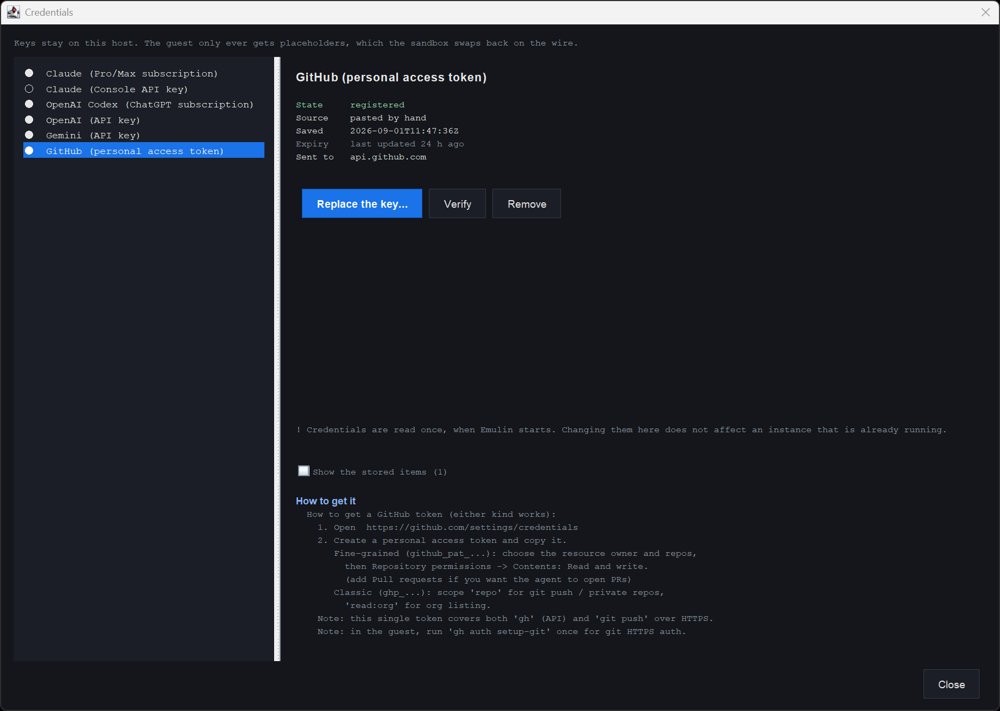
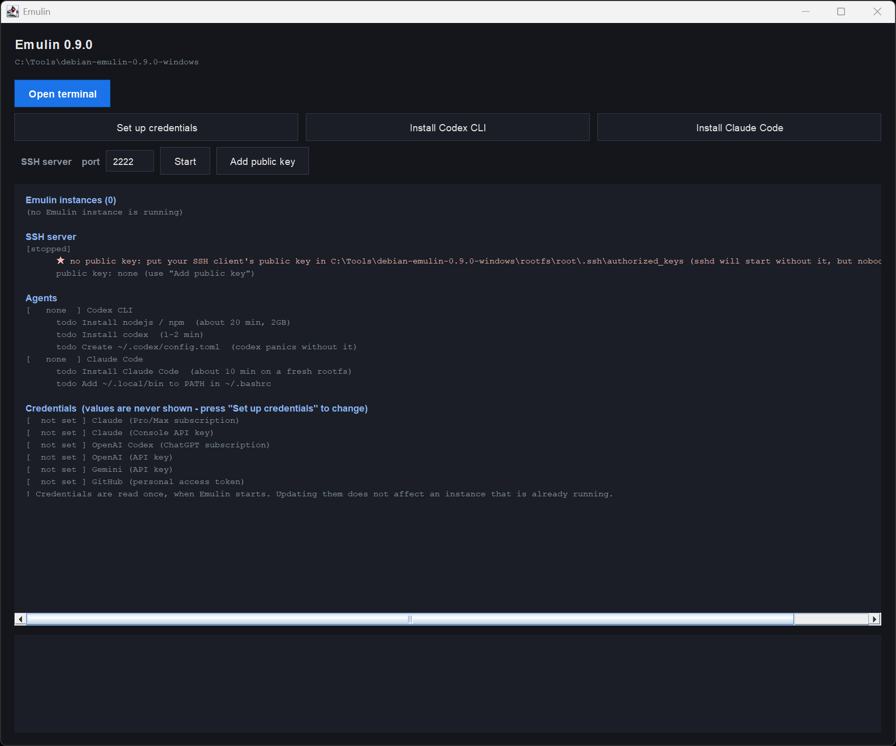
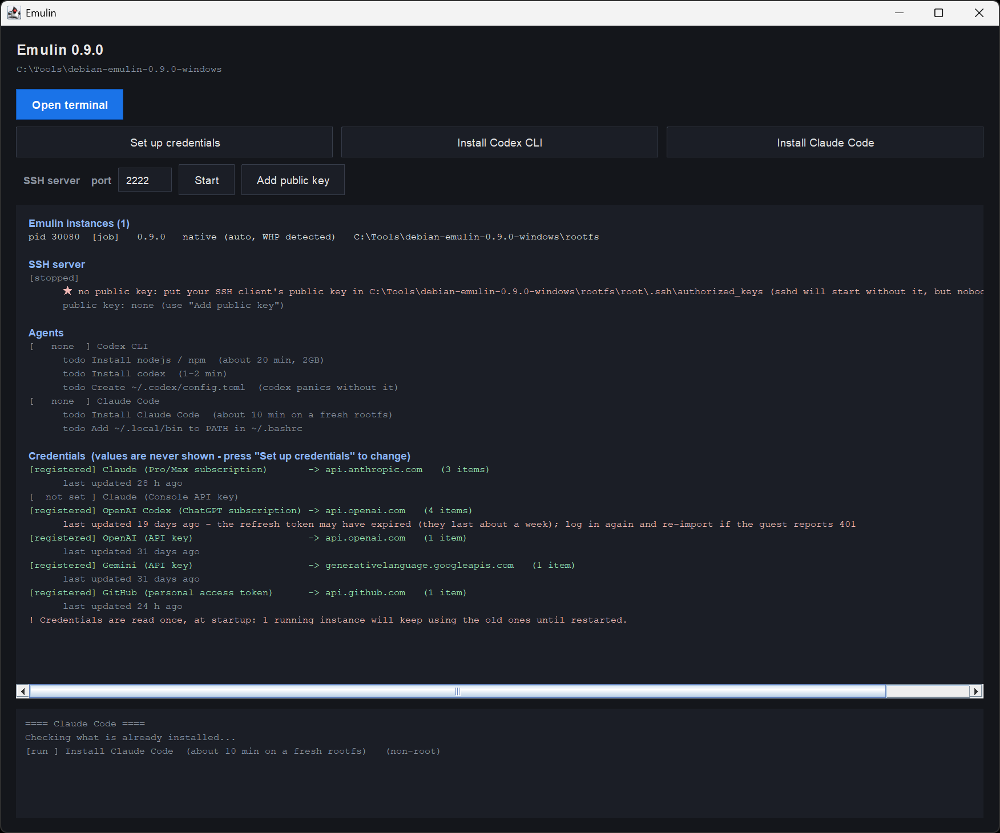
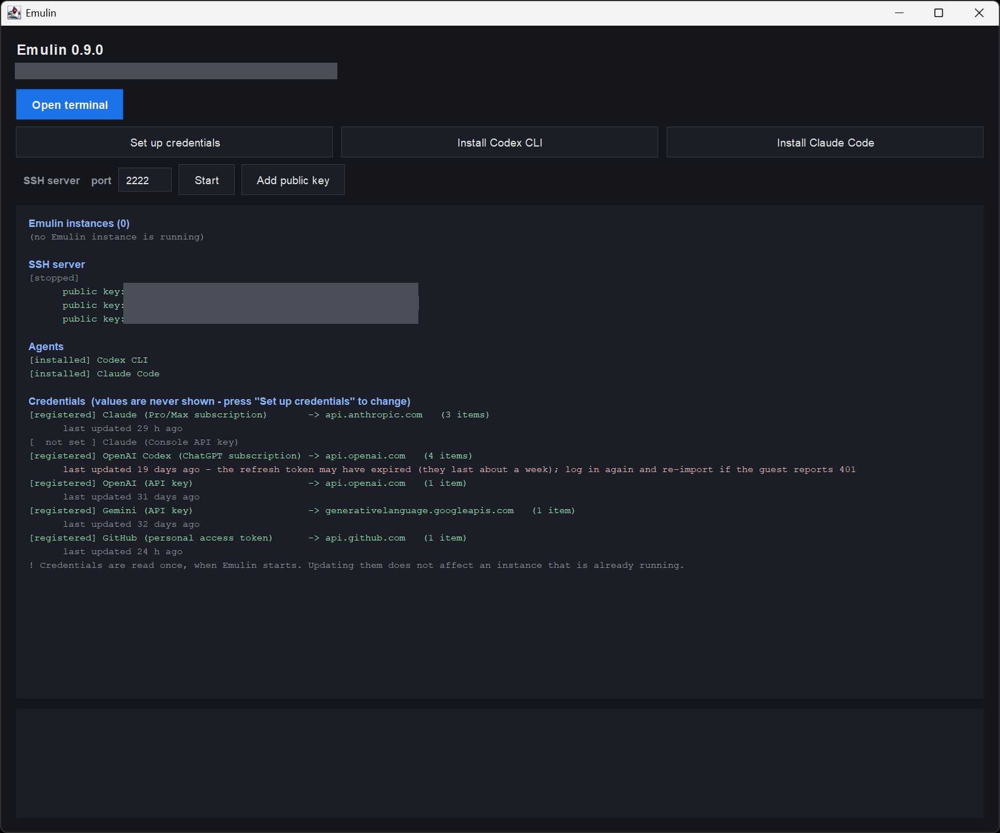

# Emulin

**English** | [日本語](README.ja.md)

**A 32/64-bit Linux ELF emulator that runs on Java**

GNU General Public License v2 (see `COPYING` for details)

---

## Overview

Emulin is an emulator that runs Linux x86 (32-bit) / x86-64 (64-bit) ELF
binaries on Java. Because it is pure Java, you can run Linux binaries on
Windows / macOS.

It can run real Linux binaries (git / curl / openssl / Python 3.12 / vim 9.1 /
emacs-nox / GNU coreutils, etc.).

It also has a **native execution backend using Windows Hypervisor Platform
(WHP) on Windows / KVM on Linux**: where available, the guest runs on a real
vCPU for a large speedup (it falls back to pure-Java execution automatically
when unavailable).

## Get started

Download a release zip from [Releases](https://github.com/kiyoka/Emulin/releases)
(or build one with `dist/build-release.sh`) and unzip it anywhere. A JRE is
bundled, so **you don't need to install Java**.

> As of 0.9.0, prebuilt release zips are published **for Windows only**
> (`debian-emulin-<version>-windows-x64.zip`). On Linux / macOS, build a
> bundle locally with `PLATFORMS="linux-x64" dist/build-release.sh` etc.

## Features

- Written entirely in Java (pure Java, no JNI)
- Runs both 32-bit ELF (i386) and 64-bit ELF (x86-64)
- Runs dynamically linked real binaries (PIE / ld.so / libc / pthread support)
- **Debian 13 (trixie) base-equivalent bundle + `apt` / `dpkg`** — packages can
  be added on top of emulin via `apt-get install` / `dpkg -i`, complete with
  GPG signature verification
  ([Adding Debian packages](#adding-debian-packages-apt--dpkg))
- Full AES-NI / PCLMULQDQ instruction implementation (matches the FIPS-197 host)
- Full pthread support (clone+futex / per-thread signal mask / mutex contention)
- Full TLS 1.3 support (via gnutls, including cert verify)
- AF_INET6 (IPv6) socket support — client TCP / UDP + server (accept4); AF_UNIX
  also supported
- JLine 3 for common raw mode / Ctrl-C / SIGWINCH support across
  Linux/macOS/Windows
- **Interactive bash / vim / emacs editing in Windows Terminal**
- **Basic-block JIT translator (optional)**: with `EMULIN_USE_JIT=1`, x86-64
  instructions are translated to Java bytecode. AES-NI / PCLMULQDQ are also
  supported, giving -13~14% speedup on HTTPS (off by default)
- **Native execution backend (Hyper-V WHP / KVM)**: runs the guest on a real
  vCPU and traps only syscalls into emulin. ~200x faster for compute-bound work,
  and byte-identical to software
  ([Native execution](#native-execution-for-speed-hyper-v--kvm))
- **SSH server support**: start OpenSSH sshd from the launcher's **Start**
  button (or `emulin sshd`) and connect with an external SSH client
  ([Using as an SSH server](#using-as-an-ssh-server))
- **AI coding agents**: Claude Code (current Bun build) and Codex
  run interactive coding sessions on top of Emulin
  ([Running AI coding agents](#running-ai-coding-agents-claude-code--codex))

## Real binaries that work (examples)

- **GNU coreutils 30+** (cat / ls / cp / mv / sort / find / grep, etc.)
- **bash 5.2 + line edit** (history / cursor / Tab, via JLine raw mode)
- **vim 9.1** — `vim -e -s` ex mode + interactive editing (insert / `:wq`)
- **emacs-nox 29.3** (interactive editing)
- **Python 3.12 stdlib** (re / json / collections / enum / functools / math /
  datetime, etc.)
- **OpenSSL 3.0.13** (TLS 1.3, AES-GCM, HTTPS handshake)
- **curl / wget HTTPS** (HTTP/1.1 / HTTP/2, multi-site: github / cloudflare /
  google / iana / raw.githubusercontent, etc.)
- **git**: init / add / commit / log / status / diff / clone
  (git:// / file:// / https:// all supported, including `--depth` / templates /
  hardlinks)
- **less 643** (vt100 keybindings, SIGWINCH support)
- **Claude Code / Codex** — interactive AI coding
  sessions ([Running AI coding agents](#running-ai-coding-agents-claude-code--codex))

## Runtime environment

| Item | Details |
|------|---------|
| JDK / JRE | **25 or later** (developed and tested on OpenJDK 25 LTS; uses the Java FFM API, #221) |
| OS | Linux (primary) / Windows 11 Home or later / macOS |

## Quick start

### Getting started on Windows (no Java required)

A JRE (Microsoft Build of OpenJDK 25) is bundled, so **you do not need to
install Java separately**. Just unzip and run.

1. **Enable the Windows Hypervisor Platform (WHP)** (first time only, recommended)
   With WHP enabled, emulin runs the guest on a real vCPU for a large speedup,
   which is recommended for almost all use. (It still runs without WHP as pure
   Java, but slower.) In an **Administrator PowerShell**:
   ```powershell
   dism /Online /Enable-Feature /FeatureName:HypervisorPlatform /All
   ```
   Or, via "Control Panel → Programs → Turn Windows features on or off", check
   **"Windows Hypervisor Platform"**.
   **Reboot Windows after enabling.** (Available on Windows 11 Home or later;
   coexists with WSL2.)

2. **Download the distribution zip**
   Get `debian-emulin-0.9.0-windows-x64.zip` from
   [Releases](https://github.com/kiyoka/Emulin/releases) (or build one locally
   with `dist/build-release.sh`). It is a Debian 13 (trixie) base with `apt` /
   `dpkg`, bundling git / curl / wget / openssl / python3 / vim / emacs, etc.

3. **Unzip anywhere**
   e.g. `C:\Tools\debian-emulin-0.9.0-windows\` (paths with Japanese characters
   or spaces work, but an ASCII path is recommended where possible).

4. **Open the launcher** (recommended)
   Double-click `emulin-app.bat` in the unzip directory. **Open terminal**
   starts bash, and the other buttons install the agents and register
   credentials — see [Use the launcher](#use-the-launcher-recommended-090).
   (The first run unpacks the bundled rootfs, so it takes a moment.)

   To go straight to a shell instead, double-click `emulin.bat`, or run it from
   cmd / Windows Terminal:
   ```cmd
   cd C:\Tools\debian-emulin-0.9.0-windows
   emulin.bat
   ```

<details>
<summary>Before bash comes up, two prompts always appear (creating a regular user, and choosing the login user)</summary>

You do not land on a `#` prompt right away:

- **Create a regular user (first run only)** — besides root, `emulin.bat`
  sets up a non-root user (some apps such as the mozc IME refuse to run as
  root, just like on real Linux). The first time, it asks for a name:
  ```
  [emulin] First-time setup: create a regular (non-root) user account.
  Username to create (uid 1000, blank to skip):
  ```
  Enter a name to create a user with **uid 1000 / home `/home/<name>` /
  shell `/bin/bash`**, recorded in `/etc/emulin-user` (skipped on later
  runs). Press Enter with no name to skip and use root only.

- **Pick the login user (every run)** — once a non-root user exists, each
  startup asks whether to log in as root or that user:
  ```
  [emulin] Log in as:  [1] root   [2] <name>
  Choice (1/2, default 1):
  ```
  `1` or an empty Enter → **root** (HOME=`/root`, for system tasks like apt);
  `2` → **that user** (uid 1000, HOME=`/home/<name>`, for day-to-day work and
  desktop apps). Set `EMULIN_LOGIN=user` beforehand to skip this menu and
  always start as the non-root user.

Once you answer these, bash starts:
```
# echo hello
hello
# uname -m
x86_64
# exit
```

</details>

5. **Single-command mode / running real binaries**
   `debian-emulin-0.9.0-windows` bundles git / curl / openssl / python3, etc.,
   so you can run them right after unzipping:
   ```cmd
   emulin.bat ls /
   emulin.bat /usr/bin/git --version
   emulin.bat /usr/bin/git clone --depth=1 https://github.com/octocat/Hello-World.git /tmp/cloned
   ```

To add packages with `apt`, see
[Adding Debian packages](#adding-debian-packages-apt--dpkg).

> **Notes**:
> - The bundled JRE is the Microsoft Build of OpenJDK 25 (GPLv2 + Classpath Exception). See the bundled `NOTICE.txt` for details.
> - `emulin.bat` invokes the bundled JRE (`jre\bin\java.exe`) internally, so it works even if Java is not on PATH.
> - With no arguments, `emulin.bat` opens an interactive bash shell in Windows Terminal (`set EMULIN_NO_WT=1` for the plain console).

## Adding Debian packages (apt / dpkg)

`debian-emulin-0.9.0-windows-x64.zip` is built on a rootfs that is
**equivalent to a Debian 13 (trixie) base**, and bundles `apt` / `dpkg` along
with apt's prerequisites (`/etc/apt/sources.list.d/debian.sources` +
`debian-archive-keyring` signing keys). As a result, adding packages with
`apt-get` works end-to-end on top of emulin, **complete with GPG signature
verification** (trixie main / trixie-security from deb.debian.org).

```cmd
rem Fetch the package index
emulin.bat /usr/bin/apt-get update <nul

rem Add a package (e.g. GNU hello)
emulin.bat /usr/bin/apt-get install -y hello <nul

rem Run / verify the added binary
emulin.bat /usr/bin/hello
emulin.bat /usr/bin/dpkg-query -W hello
```

On Linux / macOS (with a locally built bundle) use
`./emulin.sh /usr/bin/apt-get ...` and `</dev/null` to close stdin; for direct
execution from source, read it as
`java -XX:-DontCompileHugeMethods -jar emulin-*-all.jar <rootfs> /usr/bin/apt-get ...`.
A local rootfs with `apt` can also be created with
`dist/build-debian-base.sh <rootfs>`. Local install via `dpkg -i <pkg>.deb`
works the same way.

> **★ Add `-y` and close stdin.** `apt-get` reads standard input (fd 0). When
> stdin is blocked (e.g. via a script with no terminal), it waits at the
> confirmation prompt and appears to "hang". For non-interactive use, add
> **`-y`** plus **`<nul`** on Windows or **`</dev/null`** on Linux / macOS —
> that is why every line above carries it (not needed when you run it
> interactively from a terminal).

## Using as an SSH server

You can start OpenSSH **sshd** on top of Emulin and connect from an external SSH
client (OpenSSH `ssh` / Tera Term, etc.) to interactively operate bash / vim /
emacs. Because it goes through a real SSH client, it avoids the Windows console
key limitations (Ctrl+Space, etc.).

> **The daemon does not start automatically.** Emulin is a single-process
> emulator with no init/systemd. You start sshd explicitly — with the
> launcher's **Start** button, or with `emulin sshd`.

> **★ The listener is reachable from the local network.** Emulin ignores the
> address a guest passes to `bind()` and **always listens on all interfaces
> (`0.0.0.0`)**. So even though sshd itself prints `Server listening on
> 127.0.0.1 port 2222.` and `sshd_config` says `ListenAddress 127.0.0.1`, the
> listener is **not** restricted to loopback. (Auth is publickey-only, so a
> client whose key is not registered cannot get in.) To keep outside hosts out,
> block inbound port 2222 in the Windows firewall.

### With the launcher (recommended, 0.9.0+)

The bottom row of the launcher — the `port` field, **Start**, and
**Add public key** — is the whole feature.

#### 1. `Add public key` — register your client's public key

sshd here is **publickey-only**, so this comes first. Pressing the button lists
the public keys found on the host, each with its type, `SHA256:` fingerprint,
comment, and **the file it came from**:

```
[installed] ssh-ed25519  SHA256:xxxx...  you@windows  - C:\Users\you\.ssh\id_ed25519.pub
[   new    ] ssh-ed25519  SHA256:yyyy...  you@wsl      - \\wsl.localhost\Debian\home\you\.ssh\id_ed25519.pub
```

It searches `%USERPROFILE%\.ssh` **and every WSL distribution's** `~/.ssh`
(`\\wsl.localhost\<distro>\home\<user>\.ssh`, and `\root\.ssh`). The key you
want is often the WSL one, because that is where you run `ssh` from. Select a
line and press **Add**; for a key kept elsewhere use **Choose a file...**, which
applies the same checks.

- It writes to **both** `/root/.ssh/authorized_keys` and the non-root user's
  `/home/<user>/.ssh/authorized_keys`, so `ssh root@` and `ssh <user>@` both
  work. Keys are matched by fingerprint, so pressing **Add** on a key that is
  already registered does nothing, and existing lines are never removed.
- `[installed]` means the key is in **all** of those files. A key that reached
  only root is deliberately still shown as new — otherwise the screen would read
  "installed" while `ssh <user>@` keeps being refused, with nothing on screen to
  explain why.
- **A private key is refused.** The check reads the *content* (`-----BEGIN`,
  `PRIVATE KEY`), not the file name, so a private key that happens to be named
  `*.pub` is caught too. A private key inside the guest would defeat
  [Keeping API keys out of the guest](#keeping-api-keys-out-of-the-guest).

The `SSH server` section then shows the fingerprint of every registered key —
that is how you confirm the guest holds the key you think it holds:

```
[stopped]
      public key: SHA256:xxxx...
```

#### 2. `Start` — start sshd


Change the port if you need something other than 2222, then press **Start**.
Anything that would stop it from working is shown *before* you press, in the
`SSH server` section:

```
[stopped]
      ★ port 2222 is already in use.  (another Emulin is using it: pid 12345)
      ★ this build has no sshd (you need a zip built with INCLUDE_SSHD=1)
      ★ no public key: put your SSH client's public key in ...\rootfs\root\.ssh\authorized_keys (sshd will start without it, but nobody can connect)
      public key: none (use "Add public key")
```

The port check works by **actually binding** the port, so a non-Emulin process
holding it is caught as well. And when something is wrong, **pressing Start does
not start sshd** — it writes the reason to the log and stops:

```
★ no public key: put your SSH client's public key in ...\rootfs\root\.ssh\authorized_keys (sshd will start without it, but nobody can connect)
  Add a public key first, then press the button again.
```

Refusing is deliberate for the missing key: sshd *would* start without one and
simply turn away every login, which reads as a client-side problem hours later.

Once it is up, the same section prints **the exact command to connect**,
including the one to use from WSL2:

```
[running] 127.0.0.1:2222
      ssh -p 2222 root@127.0.0.1
      ssh -p 2222 <user>@127.0.0.1
      ssh -p 2222 <user>@172.25.144.1     (from WSL)
```

> **★ From WSL2, `127.0.0.1` does not reach it.** WSL2 has its own network, so
> its `127.0.0.1` is not the Windows one; you need the gateway address. That is
> why the launcher prints that line for you.

The button then reads **Stop**. sshd runs as its **own process**, so it keeps
running after the launcher window is closed — open the launcher again and it
finds the running one and shows **Stop** (it matches both the port ledger and
the live-instance ledger, so it never offers to stop an unrelated process that
happens to hold 2222).

> **★ If you add a key while sshd is running, restart it.** The non-root user's
> `authorized_keys` is refreshed from root's, and its ownership and permissions
> are fixed, **as part of the start sequence** — and **sshd silently refuses a
> key whose permissions are wrong** (StrictModes). Press **Stop**, then
> **Start**.

<details>
<summary>Doing it by hand (<code>emulin sshd</code>)</summary>

```bash
# 1. You need a bundle that includes sshd (release/full bundle, or build with INCLUDE_SSHD=1)
# 2. Register the connecting SSH client's public key in authorized_keys
#    (rootfs/root/.ssh/authorized_keys inside the bundle)
cat ~/.ssh/id_ed25519.pub >> <bundle>/rootfs/root/.ssh/authorized_keys

# 3. Start sshd (when port is omitted: 2222, user=root, publickey auth)
emulin.bat sshd             # or: emulin.bat sshd 2222   (on Linux / macOS, ./emulin.sh sshd)

# 4. Connect from another terminal
ssh -p 2222 root@127.0.0.1
#   Tera Term: Host=localhost / TCP port=2222 / User=root / Auth=publickey
```

Stop it with Ctrl-C.

From WSL2 or another machine on the same network, use the Windows-side address
instead of `127.0.0.1`:

```bash
# from WSL2 (172.25.144.1 is the Windows side = the WSL2 gateway; check with ip route)
ssh -p 2222 <user>@172.25.144.1
```

**Connecting as the non-root user (uid 1000) too.** Publickey auth in sshd is
**per user**, so `/root/.ssh/authorized_keys` only gets you in as root. The
non-root user needs its own `/home/<user>/.ssh/authorized_keys` — that is the
account you use for things that must not run as root, such as claude.

`emulin.bat sshd` does this for you: at startup it copies root's
`authorized_keys` over to the user and sets `chmod 700` (directories),
`chmod 600` (key file) and `chown 1000:1000`. Both targets are printed:

```
[emulin sshd]   connect as root: ssh -p 2222 root@127.0.0.1
[emulin sshd]   connect as user: ssh -p 2222 <user>@127.0.0.1
```

> **★ Register the key before starting sshd.** The copy runs once, at sshd
> startup — a key added to `/root/.ssh/authorized_keys` afterwards does not
> reach the user until the next start.

To give the user a **different** key, install it by hand. **sshd silently
refuses the key if the ownership or permissions are wrong** (StrictModes):

```bash
# inside the guest, as root
u=<user>
mkdir -p /home/$u/.ssh
cat /path/to/id_ed25519.pub >> /home/$u/.ssh/authorized_keys
chmod 700 /home/$u /home/$u/.ssh
chmod 600 /home/$u/.ssh/authorized_keys
chown -R 1000:1000 /home/$u
```

</details>

The placeholders from [Keeping API keys out of the
guest](#keeping-api-keys-out-of-the-guest) reach SSH sessions through
`~/.ssh/environment`, which is written for **both** root and the non-root user,
so `claude` / `codex` work over a non-root SSH login as well.

The host key is automatically `chmod 600`'d at startup. Host environment
variables are inherited by the guest (issue #228).

## Keeping API keys out of the guest

An AI coding agent runs arbitrary code. If you put a real API key inside the
guest, the agent — or anything it runs — can read it. 0.8.0 solves this
structurally: the guest only ever sees a **placeholder**, and the real key stays
on the host.

```
  guest (sandbox)                host
  claude / codex                 ~/.emulin/credentials.json  (real key)
    ANTHROPIC_API_KEY      TLS         |
      = sk-ant-emph01-...  ------->  MITM proxy swaps the placeholder
                                     for the real key on the wire
                                             |
                                             v  api.anthropic.com
```

Reading the environment or config files inside the guest never yields the real
key. Only the outbound TLS connection to the credential's own endpoint is
intercepted; everything else passes through untouched.

> **The placeholder changes every time Emulin starts.**
> Copying it literally into a config file will give you a 401 on the next run.
> Have your tool read the environment variable *at runtime* instead —
> e.g. in Emacs: `(setenv "SUMIBI_AI_API_KEY" (getenv "OPENAI_API_KEY"))`

Register credentials on the host from the launcher's (`emulin-app.bat`) **Set up
credentials** screen, or with the interactive CLI wizard:

```bat
emulin.bat setcred
```

It supports Claude / OpenAI / Gemini / **GitHub**, and each launch prints which credentials
are configured. The store lives at `C:\Users\<user>\.emulin\credentials.json`
(note: this is the **Windows** home, not the WSL one).



Pick a provider on the left and the right pane shows its **state, where it was
imported from, where it is sent**, and **How to get it** (the steps and the URL).
**No value is ever displayed** — only names, dates and destinations. The steps
can be selected and copied.

### GitHub token (`gh` / `git push`)

Register a GitHub personal access token and the guest can use `gh` and
`git push` (HTTPS) **without a real token ever being stored inside the guest**.
For letting an agent open pull requests this matters even more than the API keys.

Pick **GitHub (personal access token)** in **Set up credentials** (or `setcred`)
and paste a token created at `https://github.com/settings/credentials`. Both
kinds work: a fine-grained token (`github_pat_...`) needs **Contents: Read and
write** on the repositories you want to push to, and a classic token
(`ghp_...`) needs the `repo` scope.

Inside the guest, run this once so git authenticates through gh:

```bash
gh auth setup-git
```

> One token covers both `gh` (API) and `git push` over HTTPS. Git's HTTPS auth is
> Basic, which buries the token inside base64 — the MITM relay decodes it and
> substitutes the real token, so the guest never sees it.

Enabled by default; set `EMULIN_EGRESS_MITM=0` to turn it off. With no
credentials registered the whole path is a no-op.

## Running AI coding agents (Claude Code / Codex)

Since 0.7.0, **practical AI coding agents run on top of Emulin**. Claude Code
and Codex both support interactive coding sessions. On
Windows, the WHP native backend is strongly recommended
([Native execution](#native-execution-for-speed-hyper-v--kvm)).

**0.8.0 adds a communication sandbox so you never hand your API key to the
agent** — see [Keeping API keys out of the guest](#keeping-api-keys-out-of-the-guest).

### Use the launcher (recommended, 0.9.0+)

The launcher opened by `emulin-app.bat` (or `emulin.bat app`) covers
**installation, credential setup, and starting a session** end to end. The
summary below maps each button to what it does (see each section's "Doing it
by hand" fold for the equivalent CLI steps).



This is what you get the first time you open it. **Agents** lists what is not
installed yet and **Credentials** lists what is not registered yet; from here
it is a matter of pressing the buttons you need.

| Launcher screen | What it does |
|---|---|
| **Install Claude Code** / **Install Codex CLI** | Detects what's already done and runs only the missing steps, switching the run-as user (root/non-root) automatically |
| **Set up credentials** | Imports the login you did on the host (below) and lets you review/delete registrations (the GUI form of `emulin.bat setcred`) |
| **Open terminal** | Opens the equivalent of `emulin.bat` (Windows Terminal). Run `claude` / `codex` from there |
| **SSH server** `Start` / **Add public key** | Starts sshd and registers your SSH client's public key, so you can work over `ssh` instead of the console ([Using as an SSH server](#using-as-an-ssh-server)) |

Because the buttons switch the run-as user for you, you don't need to track
which install step needs root vs. non-root, as described in the table below.
**Authentication still needs a browser step on the host** — the GUI cannot do
that part for you (the "Authentication" steps below still apply).

An install prints each step with the user it runs as and the elapsed time.
Installing nodejs/npm takes **about 20 minutes**, so the elapsed clock is there
to tell "still working" from "stuck".



Once everything is done, **Agents reads `[installed]` and Credentials reads
`[registered]`** — that is the "ready to use" state.



> The grey bars in the image above are redactions made for publication (the
> unzip path and the SSH public-key fingerprints). The real screen shows them.

<details>
<summary>Tuning the guest memory pool (<code>EMULIN_NATIVE_POOL_MB</code>) — 1024 for agent sessions, and telling a real pool shortage from any other <code>Killed</code></summary>

**The value is not the same on every path out of the launcher:**

| How the guest is started | `EMULIN_NATIVE_POOL_MB` |
|---|---|
| `emulin.bat`, and the launcher's **Open terminal** | inherited from the host environment; **2048** when it is unset (`emulin.bat`) |
| **SSH server** `Start` (via sshd) | fixed at **1024** (`SshdService.SSHD_POOL_MB`) |
| **Install Claude Code** / **Install Codex CLI** | **removed** — a fixed pool stalls a bulk `apt` / `dpkg` run |

**★ `Open terminal` does not set 1024 for you.** It starts `emulin.bat` with the
launcher's own environment unchanged (`LauncherApp.java:355`), and `emulin.bat`
only fills in 2048 when the variable is unset. To run a session at 1024, set it
**before starting the launcher** — everything the launcher opens inherits it:

```cmd
set EMULIN_NATIVE_POOL_MB=1024
emulin-app.bat
```

**Why 1024 for an agent.** The value is the guest physical memory **per
process**, taken from the low 32 GB window on WHP. An agent runs shell and tool
processes alongside itself, so at 2048 MB each the window fills up and processes
that no longer fit fall back to the software backend (#379), which is
**dramatically slower**. At 1024 twice as many processes fit, so everything
stays on the native backend.

**Conversely, a smaller value (e.g. 512) suits bulk `apt-get install`.** dpkg
runs a large number of short-lived processes, which makes the window tight — on
a real machine the pool was shrunk from 2048 down to 264 MB. This line means the
window is getting crowded:

```
[native] guest RAM pool shrunk to fit: 2048->264MB (32GB window tight, issue #379)
```

**★ Bigger is not always better, and it is not a cure-all for `Killed`.** On
WHP, `VirtualAlloc(MEM_COMMIT)` charges the pool against the system commit
limit, so a large per-process pool on a machine with modest RAM (16 GB, say)
squeezes the whole session — an agent runs several guest processes at once.

Before turning the number up because a guest process died with `Killed`, check
whether the pool is actually the cause. Capture the diagnostics in a file: a TUI
agent takes over the screen, and `emulin.bat 2> file` does **not** reach the JVM
when the launcher relaunches itself in Windows Terminal.

```cmd
set EMULIN_TRACE_FILE=C:\temp\emulin-trace.log
emulin.bat
```

```
[native] pool exhausted -> OOM-kill (SIGKILL): ... name=<the process that died>
```

That line means the pool was too small. **If it does not appear, the pool is not
the cause.** In #921 the same `Killed` came from `kill(-pgid)` being delivered to
the caller itself, and raising the pool changed nothing.

If an install is cut short for any reason, resume it with:

```cmd
emulin.bat /usr/bin/dpkg --configure -a <nul
emulin.bat /usr/bin/apt-get -f install -y <nul
```

</details>

### Claude Code

**Where and as whom you run each step differs.** The shape of it:

| Step | Where | As whom |
|---|---|---|
| Install | **guest** | non-root user (uid 1000) |
| Authentication (`claude auth login` → `setcred`) | **host (Windows)** | — |
| Start a session (`claude`) | **guest** | non-root user (uid 1000) |

Install and run share the same non-root user because the official installer is
a per-user install into `~/.local/bin` (installing as root puts it in
`/root/.local/bin`, where the uid-1000 session cannot see it). Authentication
happens on the host so that the **real token never enters the guest**
(see [Keeping API keys out of the guest](#keeping-api-keys-out-of-the-guest)).

Each step in turn:

#### Install

Use the launcher's **Install Claude Code** button. It checks the current
state, runs the official installer as the non-root user, and adds
`~/.local/bin` to `PATH` in `~/.bashrc`.

<details>
<summary>Doing it by hand</summary>

Install with the official installer. The current Bun-native build runs on
Emulin, so there is no version to pin and the auto-updater can stay on.
Claude Code needs to avoid running with root privileges, so pick **`2`** at
the `Log in as:  [1] root   [2] <user>` prompt of `emulin.bat`, then do
everything below as that user
([Running as a non-root user (uid 1000)](#running-as-a-non-root-user-uid-1000)).

```bash
# inside an Emulin started as the non-root user:
curl -fsSL https://claude.ai/install.sh | bash

# the installer puts the binary in ~/.local/bin; add it to PATH
export PATH="$HOME/.local/bin:$PATH"
claude --version
```

</details>

#### Authentication — ★ **no `/login` if a credential is registered**

If you registered a Claude credential (the launcher's **Set up credentials**, or
`emulin.bat setcred`), you do **not** need to run `/login` inside the guest —
just start `claude` and the stored credential is used. Check with `/status`:

```
Auth token:             CLAUDE_CODE_OAUTH_TOKEN
Additional CA cert(s):  /etc/ssl/emulin-ca.pem
```

> **★ Do not run `/login` inside the guest.** Completing OAuth there **writes a
> real token into the sandbox**, which defeats
> [Keeping API keys out of the guest](#keeping-api-keys-out-of-the-guest).

To register one, log in **on the host** with a config directory dedicated to the
sandbox, then pick Claude on the launcher's **Set up credentials** screen (the
CLI form is `emulin.bat setcred`):

```bash
# on the host (Windows or WSL2)
CLAUDE_CONFIG_DIR=~/.claude-emulin  claude auth login
```

> **★ Do not omit `CLAUDE_CONFIG_DIR`.** Plain `claude auth login` replaces the
> everyday login in `~/.claude`. OAuth refresh tokens **rotate on every use**, so
> when the guest and your host session share one login, **whichever refreshes
> first keeps working and the other is logged out**. Separate logins coexist
> fine — the same way you use Claude Code on a laptop and a desktop at once.

<details>
<summary>More on the credential — what 0.8.3 changed, where a WSL2 login lands, and what the guest actually gets</summary>

If you have not registered any credential, authenticate as usual with `/login`
(Claude subscription OAuth, or an API key).

**Subscription auth is the browser login (OAuth) as of 0.8.3.** What you register
is the **access / refresh pair** produced by `claude auth login`
(`CLAUDE_ACCESS_TOKEN` / `CLAUDE_REFRESH_TOKEN`).

> **★ The `claude setup-token` flow was removed in 0.8.3.** Those long-lived
> tokens are inference-only by design, and Claude Code refuses Remote Control
> with them:
>
> ```
> Error: Remote Control requires a full-scope login token. Long-lived tokens ... are
> limited to inference-only for security reasons. Run `claude auth login` ...
> ```
>
> An already-registered `CLAUDE_CODE_OAUTH_TOKEN` **keeps working for
> inference**, but Emulin prints a migration notice at startup. Re-register as
> above.

**If you logged in from WSL2**, `.credentials.json` lands in the **WSL2 home**,
which is not the Windows home. **Set up credentials** (and `emulin.bat setcred`)
also looks there and offers it (0.8.4+):

```
Found these Claude logins on this machine:
  [1] WSL2 Debian / <user> (.claude-emulin)  \\wsl.localhost\Debian\home\<user>\...
  [2] WSL2 Debian / <user> (.claude)         ...   <- your everyday login; do not pick
  [0] type a path myself
```

**Pick `.claude-emulin` (the sandbox-dedicated one)** — it is listed first for
that reason. Picking your everyday `.claude` logs that session out through the
rotation above.

The guest gets a placeholder `~/.claude/.credentials.json`, regenerated on every
launch; the real tokens stay in the host's `~/.emulin/credentials.json`. When the
access token expires, Emulin swaps the refresh on the wire and keeps the new
tokens host-side, so you do not need to redo this until the refresh token itself
expires (about a week).

</details>

#### Remote Control — **drive the guest session from your phone**

With the browser login registered, inside the guest run:

```bash
claude remote-control
```

Open the `https://claude.ai/code?environment=env_...` URL it prints, or press **`space`
to show a QR code** and scan it. From then on the Claude mobile app (Code tab) or
claude.ai/code runs commands **inside the guest**, while the real token stays on the host.

<details>
<summary>Gotchas — the URL changes on every launch, <code>PATH</code>, <code>Workspace not trusted</code>, and the slow first reply</summary>

- **It is not a list you wait to appear in** — you enter through the URL / QR
  printed at startup, and the **environment ID changes on every launch**.
  Opening a stale URL gives you a chat window that simply never answers.
- Claude Code installs into `~/.local/bin`, but Emulin starts bash with `-i`
  (non-login), so `~/.profile` is not read. Add
  `PATH="$HOME/.local/bin:$PATH"` to `~/.bashrc`.
- `Workspace not trusted` means you must start `claude` once in that directory
  and accept.
- The first reply takes minutes: a **second claude process** starts inside the
  guest.

</details>

#### Start a session

Use the launcher's **Open terminal** button (or start `emulin.bat` directly),
pick the **non-root user**, change into the directory you want to work in, and
run `claude`:

```bash
cd /mnt/c/dev/<project>
claude
```

The first time in a given directory it asks `Quick safety check: Is this a
project you created or one you trust?` — that is **not a login**; it is claude's
own per-directory trust prompt, shown once. Pick `1. Yes, I trust this folder`
and the session starts.

### Codex

**Only the install differs from Claude Code — that one step needs root:**

| Step | Where | As whom |
|---|---|---|
| Install | **guest** | **root** |
| Authentication (`codex login` → `setcred`) | **host (Windows)** | — |
| Start a session (`codex`) | **guest** | **non-root** |

The install needs root because it adds nodejs/npm system-wide with `apt-get`
and puts a global package under `/usr/lib/node_modules` with `npm -g`. That
location is shared by all users, so **sessions run as the non-root user**, the
same as Claude Code. Emulin writes `~/.codex/auth.json` for both accounts, so
switching back to the non-root user needs nothing extra.

#### Install

Use the launcher's **Install Codex CLI** button. It runs `apt-get` / `npm -g`
as root, then creates `~/.codex/config.toml` (`sandbox_mode`, below) in the
non-root user's home — **switching the run-as user for you automatically**.

<details>
<summary>Doing it by hand</summary>

> **★ Run these two as root inside the guest.** They install packages
> system-wide (`apt-get`) and put a global package under
> `/usr/lib/node_modules` (`npm -g`), so a non-root user gets permission
> errors. At the `Log in as:  [1] root   [2] <user>` prompt of a bare
> `emulin.bat`, choose **`1` (root)**.

```bash
# as root (the prompt should be #)
apt-get update && apt-get install -y nodejs npm </dev/null
npm install -g @openai/codex
```

> **What it takes to get through** (measured on Emulin 0.8.2 / Debian 13 trixie, 559 packages)
>
> | | |
> |---|---|
> | User | **root** (see the note above) |
> | stdin | **Keep the `</dev/null`.** Without it a postinst prompt can stop the run |
> | Free space | **2GB or more**: the rootfs grows from 765MB to **2.0GB** (177MB downloaded) |
> | Time | **7-8 minutes** (measured on WSL2 + KVM); Windows (WHP) is comparable |
> | `EMULIN_NATIVE_POOL_MB` | **Leave it unset.** The default (512MB) is enough, and raising it does not make this faster |
>
> If the install is cut short for any reason, resume it with:
>
> ```cmd
> emulin.bat /usr/bin/dpkg --configure -a <nul
> emulin.bat /usr/bin/apt-get -f install -y <nul
> ```

Emulin's rootfs is itself the isolation boundary, and the OS-level sandbox
that codex tries to set up inside the guest (Landlock + seccomp) is not
supported (codex would panic trying to install it). Disable it in
`~/.codex/config.toml` before the first run:

```toml
sandbox_mode = "danger-full-access"
```

> **★ Write this file as the non-root user**, not as root. The install above is
> the only step that runs as root; sessions run as the non-root user, and codex
> reads the config from the home of **the user that starts it**. A copy left in
> root's home has no effect. Log back in with `2` at the
> `Log in as:  [1] root   [2] <user>` prompt before creating it.

</details>

#### Authentication — **log in on the host**

Running `codex login` *inside* the guest puts the real token inside the sandbox, which
defeats [keeping API keys out of the guest](#keeping-api-keys-out-of-the-guest). Log in on
the **host** (Windows) instead and import the result:

```bat
rem log in on the host (opens a browser; --device-auth prints a code instead)
codex login
rem    or  codex login --device-auth
```

Import it from the launcher's **Set up credentials** screen (pick OpenAI /
Codex), or on the CLI:

```bat
rem the wizard reads C:\Users\<user>\.codex\auth.json
emulin.bat setcred
```

The guest's `~/.codex/auth.json` is regenerated with placeholders on every launch, so inside
the guest you just run `codex`. The real tokens stay on the host and the MITM relay swaps
them in only on the wire (short-lived tokens are refreshed on the host side too).

> **If you logged in from WSL2**, `auth.json` lands in the WSL2 home, which
> **Set up credentials** (and `setcred`) cannot see (it is a different home
> from Windows). Copy it over:
> ```bash
> cp ~/.codex/auth.json /mnt/c/Users/<user>/.codex/auth.json
> ```

To use a pay-per-use API key instead, pick **OpenAI (API key)** in **Set up
credentials** (or `emulin.bat setcred`).

#### Start a session

Use the launcher's **Open terminal** button (or start `emulin.bat` directly),
pick the **non-root user**, change into the directory you want to work in, and
run `codex`:

```bash
cd /mnt/c/dev/<project>
codex
```

### Running as a non-root user (uid 1000)

**No setup needed.** Starting `emulin.bat` with no arguments asks for a name on
the first run, creates that user with uid 1000, and from then on lets you pick
root or that user at every startup (step 4 of the
[Quick start](#getting-started-on-windows-no-java-required)). USER / HOME are
resolved automatically from the guest's `/etc/passwd` (#611).

Set this only if you want to skip the menu and **always start as the non-root
user**:

```cmd
set EMULIN_LOGIN=user
emulin.bat
```

Use that account for anything that must not run as root, such as claude
([Running AI coding agents](#running-ai-coding-agents-claude-code--codex)).

<details>
<summary>Running <code>java -jar</code> directly, without a launcher</summary>

None of the above happens when you invoke `java -jar` yourself. Create the user
once and pass `EMULIN_UID` / `EMULIN_GID`:

```bash
./emulin.sh /usr/sbin/useradd -m -u 1000 -s /bin/bash devuser   # once
EMULIN_UID=1000 EMULIN_GID=1000 java -jar emulin-*-all.jar <rootfs> -CJ /bin/bash -i
```

</details>

### Japanese (UTF-8) text

Japanese input/output works out of the box (#716) — nothing to set up.

<details>
<summary>How the locale is decided, and installing <code>ja_JP.UTF-8</code> when you need it</summary>

- the launchers default `LANG` to `C.UTF-8` (glibc's built-in UTF-8 locale,
  no locale files needed);
- Emulin itself guarantees a usable guest `LANG` — if the host's LANG names a
  locale whose data is missing in the rootfs (e.g. `ja_JP.UTF-8` on a Linux
  host), it is normalized to `C.UTF-8` instead of silently degrading to the
  ASCII `C` locale (which would garble Japanese filenames in `ls` etc.);
- the rootfs seeds `export LANG="${LANG:-C.UTF-8}"` into `/etc/profile.d/`,
  `/etc/skel/.bashrc` and `/root/.bashrc`, so shells reached via `su` / SSH
  pick it up too.

If you need `ja_JP.UTF-8` itself (Japanese messages / collation), install the
locale into the guest once; when its data exists, the host's LANG is passed
through as-is:

```cmd
emulin.bat /usr/bin/apt-get install -y locales <nul
emulin.bat /usr/bin/localedef --no-archive -i ja_JP -f UTF-8 ja_JP.UTF-8
```

Use `localedef --no-archive` — `locale-gen`'s archive mode does not work on
Emulin yet (#717). `EMU_LANG=<locale>` overrides everything when you need to
force a specific value.

</details>

### Known limitations (AI agents)

| Limitation | Details / workaround |
|---|---|
| Claude Code `/quit` and self-update are slow | Shutdown and the auto-updater both do a lot of file I/O (the binary alone is ~275 MB). Let them finish rather than killing the session (#695 / #696). |
| Claude Code `/quit` takes a while | Shutdown runs npm, which opens many files; much improved (#696) but still tens of seconds. Just wait (#695). |
| Occasional input freeze (Windows) | Rarely Windows' **ConPTY layer** stops delivering keystrokes, including Ctrl-C (#709). Emulin is not at fault — it also happens when Emulin is not in the input path at all (connecting to `emulin sshd` with `ssh`). **Resize the terminal window once**: the pending input flushes and the session continues. A terminal that does not go through ConPTY (WezTerm's built-in SSH, Tera Term, PuTTY, …) may avoid it entirely. |
| Slow startup on large repos under `/mnt/c` | Workspace scanning (`git ls-files` / `rg --files`) over the host mount is much slower than inside the rootfs. Prefer cloning into the rootfs, e.g. `git clone file:///mnt/c/dev/repo ~/repo`. |
| Codex built-in sandbox is unavailable | `sandbox_mode = "danger-full-access"` is required; Emulin's rootfs remains the isolation boundary (user-namespace emulation for bwrap is planned in #497). |

## Native execution for speed (Hyper-V / KVM)

In environments where Windows **Hyper-V (WHP)** / Linux **KVM** is available,
you can use the **native backend**, which runs the guest on a real vCPU and
traps only syscalls into emulin. This greatly speeds up compute-bound work
(~200x for sort / grep / sha256sum, etc.; even large git clones run at a
practical speed).

The launchers (`emulin.sh` / `emulin.bat`) set `EMULIN_BACKEND=auto` by default,
so they **use native when HW virtualization is available and fall back to
software automatically otherwise**. The startup banner shows the current
backend:

```
[backend=native (auto, KVM detected (/dev/kvm OK))]   <- running on native
[backend=software]                                    <- running on software
```

**Requirements:**

- **Windows**: Enable the "**Windows Hypervisor Platform**" from Windows
  Features (can coexist with WSL2).
- **Linux**: Access to `/dev/kvm` (join the `kvm` group, or
  `sudo chmod 666 /dev/kvm`).

**Switching / tuning (environment variables):**

| Variable | Default (launcher) | Description |
|------|------|------|
| `EMULIN_BACKEND` | `auto` | `auto` (auto-detect HW virtualization) / `native` (force) / `software` (force) |
| `EMULIN_NATIVE_POOL_MB` | `2048` | Guest physical pool (MB) for the native backend. **Per process**, taken from the low 32 GB window. The 2048 default comes from `emulin.bat` / `emulin.sh` (512 if you invoke `java -jar` directly). Use `1024` for AI agents and `512` for bulk apt installs ([details](#running-ai-coding-agents-claude-code--codex)) |
| `EMULIN_TLB_FLUSH_SYSCALL` | `1` | (Windows/WHP only) Flush this vCPU's TLB at syscall boundaries. **On by default**; turning it off can corrupt the guest heap through stale TLB entries (#880) |
| `EMULIN_WHP_MAX_VCPUS` | `256` | (Windows/WHP only) Cap on concurrent vCPUs. One guest thread = one vCPU, shared by every guest process in the JVM. Raise it if a thread-heavy guest hits the limit (minimum 64) |

> The software backend is the **canonical (reference) for correctness** and is
> always maintained. The regression suite always passes on software, and native
> is **byte-identical** to software (verified by native-oracle). When in
> trouble, or for mremap-heavy workloads like `apt` (issue #304), you can run
> reliably with `EMULIN_BACKEND=software`. macOS's Hypervisor.framework (HVF) is
> planned for the future (issue #306).

## Performance

### `-XX:-DontCompileHugeMethods` (required)

When running real binaries, always add **`-XX:-DontCompileHugeMethods`**:

```bash
java -XX:-DontCompileHugeMethods -jar emulin-*-all.jar ...
```

Without this flag, the emulator's core dispatch loop (`Cpu64::decode_and_exec`,
20K+ bytecode) is rejected for JIT C2 compilation by the JVM's `HugeMethodLimit`
(default 8000 bytes) and runs in interpreter mode. The flag gives a 28% speedup
on git clone over HTTPS (14.4s -> 10.4s).

The `emulin.sh` / `emulin.bat` launchers add this flag automatically.

### `EMULIN_USE_JIT=1` (optional, Phase 34-A3/A5)

A built-in basic-block JIT translates x86-64 instructions to Java bytecode at
runtime. It is off by default, but gives a speedup on crypto workloads:

| Workload | no JIT | with JIT | Effect |
|----------|-------:|---------:|------|
| curl https://example.com  | 9.3s | 8.1s | -14% |
| curl https://github.com (570KB) | 10.4s | 9.1s | -13% |
| sha256sum 5MB             | 2.4s | 2.3s | -5%  |

For short cold-start workloads such as launching vim, it is neutral to slightly
unfavorable (offset by JIT compile cost). It is effective for HTTPS / SIMD-heavy
workloads:

```bash
EMULIN_USE_JIT=1 java -XX:-DontCompileHugeMethods -jar emulin-*-all.jar ...
```

## Known limitations

- Some Python 3 syscalls (signalfd4 / pidfd_open, etc.) are unsupported (these
  are optional paths, so it normally works)
- The **software backend** runs much slower than the host (~100x for curl HTTPS,
  ~13x for git clone). Where HW virtualization is available, the **native
  backend (Hyper-V / KVM, default auto)** speeds up compute by ~200x
- WSL DrvFs (`/mnt/c/...`) has slow I/O -> place the sandbox under Linux /tmp etc.
- AI-agent–specific limitations (Claude Code version ceiling, etc.):
  see [Known limitations (AI agents)](#known-limitations-ai-agents)

## Directory layout

```
src/main/java/emulin/        Emulin core
  Cpu.java (i386), Cpu64.java (x86-64), AbstractCpu.java
  Syscall.java, SyscallI386.java, SyscallAmd64.java
  Elf.java, ElfCache.java, Segment.java, Section.java, Memory.java
  Process.java, Kernel.java, Thread64.java, FutexManager.java
  device/Console.java, StdConsole.java, JLineConsole.java
  jit/Translator.java, jit/CompiledInsn.java  (Phase 34-A3/A5 JIT)

dist/
  build-dist.sh             distribution zip build script
  build-sandbox.sh          sandbox build script
  launchers/emulin.sh / .bat startup launchers
  gen-quickstart.sh         generates the QUICKSTART.txt bundled in the zip

tests/
  binaries/src/             x86 / x86-64 test ELF sources
  scripts/                  regression test runner scripts
  expected/                 expected output (stdout / exit / argv / stdin)
```

## How to build

> Most people do not need this — the release zip already contains everything
> (Emulin itself, a JRE, and the Debian rootfs). Build from source only if you
> want to modify Emulin.

```bash
git clone https://github.com/kiyoka/emulin.git
cd emulin
mvn package -DskipTests
```

Artifacts:
- `target/emulin-<version>-all.jar` (fat jar, JLine bundled)

This is the same fat jar the `emulin.bat` / `emulin.sh` launchers invoke inside a
distribution zip. To build a Debian-based bundle (the equivalent of a release
zip) locally, use `dist/build-release.sh`.

## Testing

```bash
make -C tests/binaries        # build the x86 / x86-64 test binaries
tests/scripts/run-fast.sh     # lightweight subset (~27s, excludes real-* / dist, 146 cases)
tests/scripts/run-all.sh      # all tests (~4m, 230 cases)
tests/scripts/run-network.sh  # network-related only (~3m, includes HTTPS clone)
```

Under parallel load, 1-3 timing flakes occasionally appear, but all PASS
standalone.

## History

`.claude/CLAUDE.md` contains a per-phase development log (summaries of each phase
of modernization + 64-bit extension + real-binary support, and the cumulative
patterns of known bugs).

## Contact

- Bugs, requests, questions: <kiyokasumibi@gmail.com>
- GitHub Issues: https://github.com/kiyoka/emulin/issues
