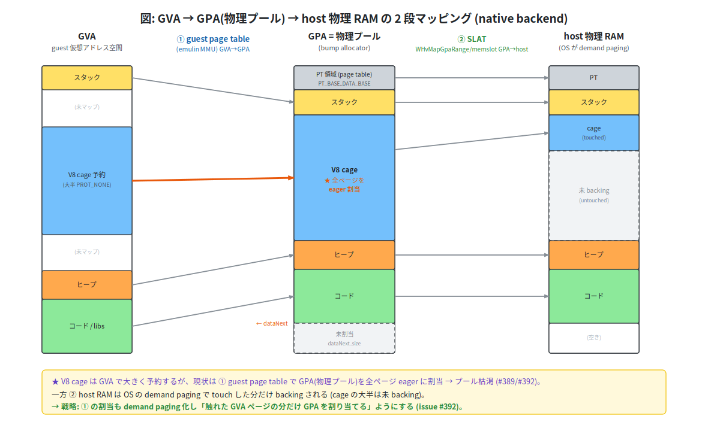
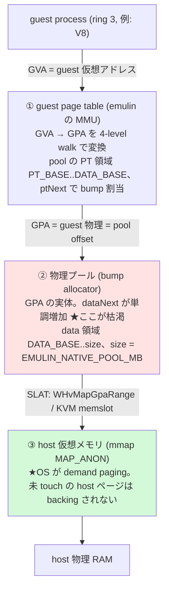
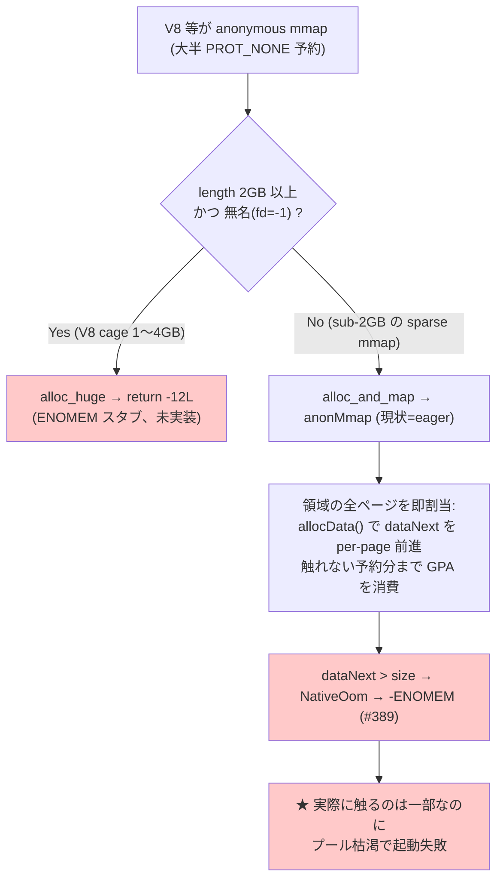
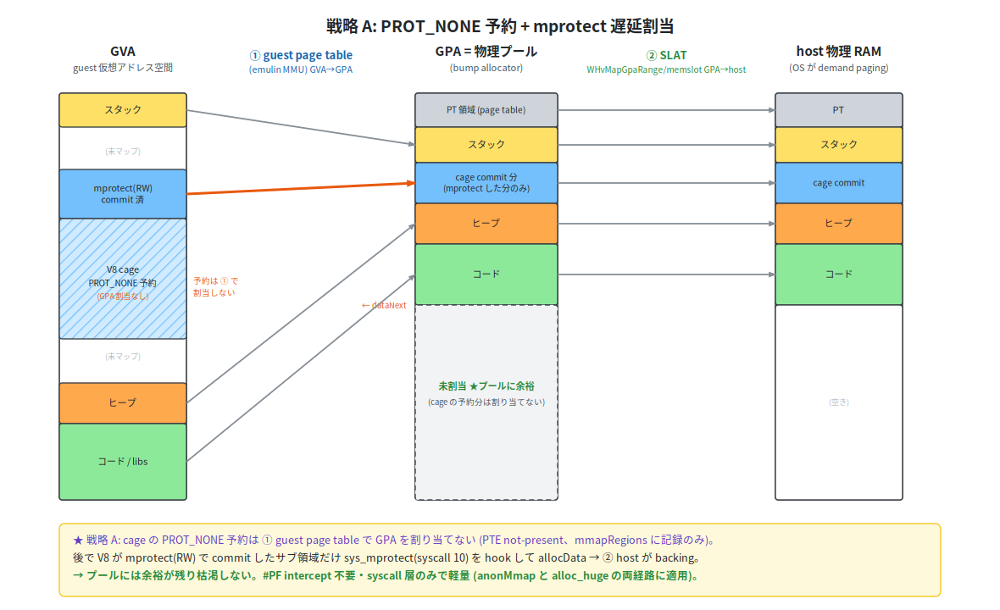
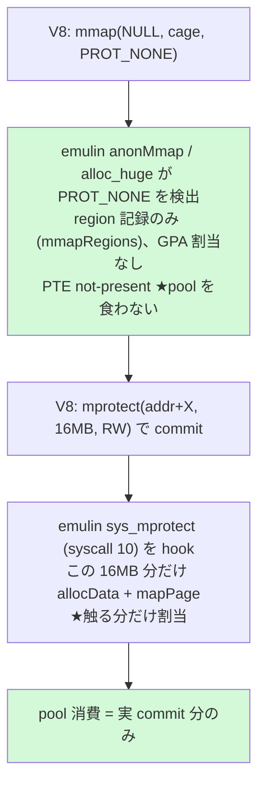
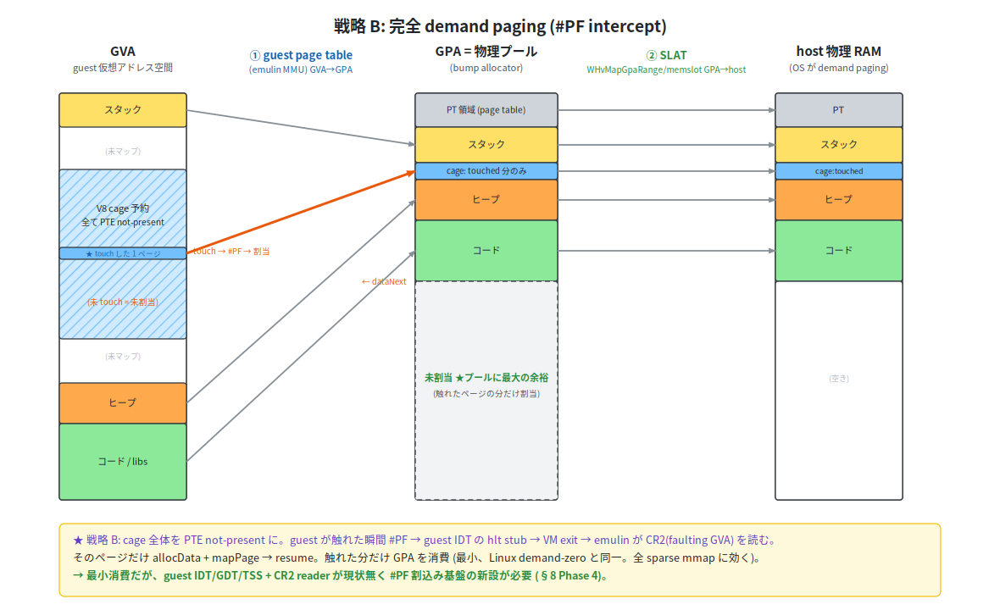
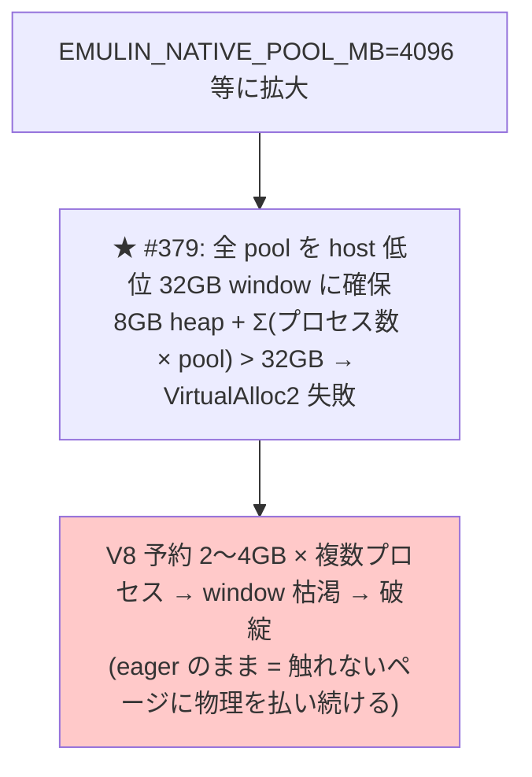
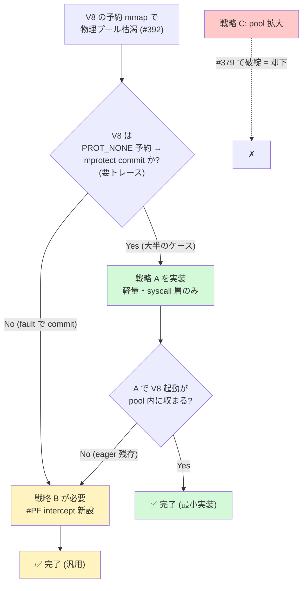

# issue #392 設計書: native backend の anonymous mmap demand paging 化

> 大きな sparse mmap（V8 の cage 予約等）で native(WHP/KVM) backend の guest 物理プールが
> 枯渇する問題を demand paging で解決する。Claude Code を起動できるようにするのが直接の動機。

---

## 0. TL;DR（結論先出し）

- **推奨**: Phase 0 実測（§8）で判明 — **node 型（PROT_NONE+mprotect）は戦略 A で足りるが、本命の claude 型（RW + MAP_NORESERVE + fault-commit）は戦略 B が必要**。**Claude Code を動かすなら戦略 B**（MAP_NORESERVE/PROT_NONE を問わず anon mmap を reserve-only にし fault で割当する汎用 demand paging）。**戦略 C**（pool 拡大）は却下。
- **却下理由（C）**: pool 拡大は #379 の「全 pool を host 低位 32GB window に確保」制約を悪化させ、eager のままで根本解決にならない。
- **承認範囲**: **Phase 0 トレース完了**（§8）。node=戦略A型 / **claude=戦略B型（RW+MAP_NORESERVE+fault-commit）と実測判明**。**claude を mmap 枯渇なく起動させるには戦略 B（#PF fault-based、重い）が必要**。次の判断は §7。
- **★追加の事実**: claude --version は emulin KVM で**実際に起動成功**（"2.1.185" 出力、6GB pool）。即ブロックではないが、小 pool / 重い使用では枯渇 → 戦略 B が要る。
- **⚠️ 重要 caveat**: 本件は「起動時の mmap 枯渇で**死なない**」ための**必要条件**であって、Claude Code を**実用速度で動かす十分条件ではない**（233MB の V8+JIT は遅い、§9）。価値は Claude Code 固有でなく、**大きな sparse mmap を使う全 native アプリへの汎用改善**。

---

## 1. 目的とスコープ

- **目的**: V8 の pointer-compression cage 予約等の大きな mmap で native(WHP/KVM) backend の **guest 物理プールが枯渇**する問題を **demand paging** で解決する。
- **スコープ**: 戦略 A/B/C の比較と方針決定（設計のみ。実装は後続 PR）。
- **非スコープ**: 実行速度は別問題（→ §9 参照）。

---

## 2. 用語と前提知識

後続で多用する語を先に定義する。

- **cage（V8 pointer-compression cage）**: V8 は 32bit ポインタ圧縮のため、連続した数 GB の仮想領域を 1 つ予約し、ポインタを cage 先頭からの 32bit offset で表す。予約は **PROT_NONE で取り、使う分だけ後から `mprotect` で RW 化**する。
- **SLAT（Second Level Address Translation）**: ハードウェアの 2 段目アドレス変換（GPA→HPA）。WHP は `WHvMapGpaRange`、KVM は memslot で GPA→host VA を登録する。
- **commit（本書での意味）**: ② guest 物理プールに GPA を割り当て、guest PTE を present にすること。③ host 側の物理確保（Windows `MEM_COMMIT`、#320）とは**別レイヤ**。
- **表記規約**: syscall は `mprotect(2)` / `syscall 10`、GitHub issue は `#389` で区別する。
- **hlt stub → VM exit 機構**: 現状 syscall は guest の LSTAR を hlt 命令の stub に向け、hlt が VM exit を起こして emulin がトラップしている。**戦略 B はこれを #PF vector に流用**する。
- **PROT_NONE 予約（reserve-only）**: アクセス権なしで仮想範囲だけ確保。物理は割り当てず、guest PTE は not-present のまま。

---

## 3. 設計方針（優先順位）

- **backend=native（特に WHP）を最優先**。Windows native(WHP) で実用ソフトが動くことがゴール。
- **backend=software は large-mmap 対象外**: software は `byte[]` ベースで大きな V8 をどのみち実行できない（実行速度 + Java `byte[]` の 2GB 上限）。demand paging は **native 専用機構**として設計する（PROT_NONE 予約や #PF intercept は native のみ。戦略は §5）。
- ただし**既存の通常プログラムの回帰は維持**: software==native の byte-identical と既存 mmap テストを壊さない（demand paging は eager と区別できないよう透過に実装）。
- **KVM は dev/test proxy、WHP が本番ターゲット**。戦略 A/B とも最終的に WHP で動くことを優先（KVM 先行検証 → WHP 受入）。

---

## 4. 背景: メモリアーキテクチャと eager 割当の問題

### 4.1 現状の 2 段変換アーキテクチャ

変換は **GVA→GPA（① guest page table が実施）** と **GPA→HVA（SLAT, ②→③ の辺）** の **2 段**。①②③ はアドレス空間/構成要素の名前であって変換段数ではない。**③(host RAM) は OS の demand paging で lazy** だが、**②(guest 物理プール) の bump allocator `dataNext` は eager に前進**するのが枯渇の元。

以下に GVA → GPA(物理プール) → host 物理 RAM の対応を、メモリ空間を箱として並べて図示する（V8 cage は概念的に「大きく予約 → ① で eager 割当 → プール枯渇」する一方、② host は touch 分だけ backing）。厳密な経路分岐は §4.2 を参照:

同じ 2 段変換の簡略フロー版:

### 4.2 問題: eager 割当と mmap の経路分岐

**まず `amd64_mmap` の振り分けを押さえる**（ここが図と実コードのズレを生みやすい）:

- `length ≥ 2GB かつ fd < 0` → **`alloc_huge`**（現状 `return -12L` の **ENOMEM スタブ**、未実装）
- それ未満 → **`alloc_and_map` → `anonMmap`**（**全ページを eager に GPA 割当**）

`anonMmap` は領域の全ページに即 GPA を割り当てる（`allocData` を per-page）。**sub-2GB の sparse な mmap** がこの経路で eager 割当され、触れない予約分までプールを食い潰して枯渇する（claude の crash は実際この `anonMmap` 経路）。一方 **V8 cage（典型 1〜4GB）は ≥2GB なので `alloc_huge` 経路**に入り、現状は即 ENOMEM で起動できない。

→ **両経路に demand paging が要る**: `anonMmap`（eager 全割当をやめる）と `alloc_huge`（ENOMEM スタブを demand-backed にする）。

---

## 5. 戦略（A/B/C）

**枠組み**: **A/B は割当を遅延させる方向**（A=mprotect 契機、B=#PF 契機の demand 化の度合い違い）、**C は割当方式を変えずプール容量を増やす対症策**。

### 戦略 A: PROT_NONE 予約 + mprotect 時の遅延割当
*（一行要約: mprotect 契機に割当。syscall 層のみで軽量・推奨の第一手）*

同じ流れの簡略フロー版:

- V8 cage は PROT_NONE で予約 → サブ領域を `mprotect(RW)` で commit。emulin は **`anonMmap` と `alloc_huge` の両方**で PROT_NONE 予約を region 記録のみにし（GPA 割当なし、PTE not-present）、`mprotect(2)` 契機に commit 範囲だけ `allocData` + `mapPage` する。
- **#PF intercept 不要**（`mprotect` は syscall 層で完結）。実装は §8 Phase 1-2。
- **前提**: V8 が「PROT_NONE 予約 → mprotect commit」パターンであること（要トレース、§8 Phase 0）。

### 戦略 B: 完全 demand paging（#PF intercept）
*（一行要約: guest が触れた時の #PF で割当。汎用だが重い）*

同じ流れの簡略フロー版:

- **あらゆる sparse mmap に効く**（V8 / Node / JSC / WASM / Go runtime / JVM 等。Linux demand-zero と一致）。
- **実装規模の実態**: 現状 native には **guest IDT/GDT/TSS が無く、CR2 reader も無い**。#PF 経路は**割込み基盤をゼロから作る大仕事**（§8 Phase 4 で 4a〜4f に分解）。`alloc_huge` の ENOMEM スタブも demand-backed に統合できる。

### 戦略 C: 物理プール拡大（却下）

`EMULIN_NATIVE_POOL_MB` 拡大は #379 の 32GB window 制約を悪化させ、eager のまま根本解決にならない。→ **却下**。

---

## 6. 取捨選択（A/B/C の比較）

### 6.1 比較表

| 観点 | **A** PROT_NONE+mprotect | **B** #PF demand paging | **C** pool 拡大 |
|------|:---:|:---:|:---:|
| pool 物理消費 | commit 分のみ | **touch 分のみ（最小）** | 全予約分（最大） |
| 実装量 | **小**（syscall 層） | 大（#PF 基盤を新設） | 極小 |
| #PF intercept | 不要 | 必要 | 不要 |
| 効く範囲 | PROT_NONE 予約パターン | **全 sparse mmap** | なし（対症） |
| anonMmap / alloc_huge への適用 | **両方必須** | demand 化に統合可 | - |
| fork 整合 | 小（eager copy で既存カバー） | 小（同上） | 影響小 |
| #379 32GB window | 緩和 | **最大緩和** | **悪化** |
| 主リスク | mprotect を介さない commit に無力 | 実装複雑・バグ余地大 | 根本解決せず破綻 |
| **総合判定 / 推奨** | **まず実施（低コスト低リスク）** | **A 不足時にエスカレーション** | **却下** |

> 脚注 #379: native pool は host 低位 32GB window に確保するため、pool を拡大すると window が枯渇する（戦略 C が破綻する理由）。

### 6.2 意思決定フロー（判断の正典）

A→B→C の判断ロジックは**この図を単一の正典**とする（§7 推奨はこの結論の宣言）。

---

## 7. 推奨と承認範囲

- **決定（Phase 0 実測後）**: 対象アプリで分岐する（判断ロジックは §6.2 図の Q1 で確定）:
  - **node 型（PROT_NONE 予約 + mprotect commit）→ 戦略 A**（軽量・syscall 層）
  - **claude 型（RW + MAP_NORESERVE + fault-commit）→ 戦略 B**（#PF fault-based、重い）
  - **戦略 C は却下**。
- **本命の Claude Code は戦略 B が必要**。戦略 A は mprotect を hook するが、claude は mprotect をほぼ使わず RW+MAP_NORESERVE を fault で commit するため捕捉できない。
- **意思決定の依頼**:
  - **(a) claude を mmap 枯渇なく動かしたい → Phase 4（戦略 B）に着手**（MAP_NORESERVE/PROT_NONE 問わず reserve-only + fault 割当の汎用 demand paging。node 等も同時にカバー）。
  - (b) 軽量に node 等の PROT_NONE+mprotect 型を先に通すなら Phase 1-3（戦略 A）→ 後で B。
  - **いずれも実行速度 caveat（§9）は不変** — 戦略 B で起動の mmap を解決しても、233MB V8+JIT は emulin で実用速度では動かない。戦略 B の主価値は **大 sparse mmap を使う全 native アプリへの汎用改善**。

---

## 8. 段階的実装プラン

| Phase | 内容 | 戦略 |
|------|------|------|
| **0** | **トレース確認**。前提: `sys_mprotect` は現状 no-op (`return 0`) でトレース出力が無いため、先に `mprotect(2)` に `EMULIN_TRACE` 出力を追加する。その上で V8/Claude Code の mmap/mprotect パターン（PROT_NONE 予約→mprotect commit か、fault commit か）と予約サイズ（≥2GB=alloc_huge 経路か）を実測し、戦略 A の前提を検証 | 調査 |
| **1** | `anonMmap` と `alloc_huge` の**両方**で PROT_NONE 予約を **region 記録のみ**（PTE not-present）に。`anonMmap` に **prot 引数を追加**（現 signature は prot を捨てている）。占有判定（hint / brk / realloc の 3 経路）を「PTE present」だけでなく **mmapRegions の予約範囲も参照**するよう共通ヘルパ化（reserve-only と committed を同一占有扱い） | A |
| **2** | `MemoryBackend` に **`commitProtect(addr,len,prot)` を新設**。software は **no-op**（byte-identical 維持）、`sys_mprotect` / amd64 override から呼ぶ。逆方向（RW→PROT_NONE）は既定で**内容保持の not-present**、free-list 返却（#334）は内容破棄が許される **decommit 経路**（V8 decommit 等）に限定 | A |
| **3** | **A の効果測定 gate**: V8 / Claude Code 起動が pool 内に収まるか。回帰（software==native byte-identical、既存 mmap テスト）。ここで A 不足なら B へ | A |
| **4** | **戦略 B** を sub-step に分解: **4a** guest IDT/GDT/TSS 構築 + IDTR/GDTR、**4b** #PF vector の hlt stub（error code 読み）、**4c** `HvVcpu`/`KvmVcpu`/`WhpVcpu` に CR2 + error code 読み出し API、**4d** EXIT 経路で #PF を SHUTDOWN/triple fault と区別、**4e** mmapRegions 照合で legal demand fault と wild access（→SIGSEGV）を判別、**4f** WHP 例外 intercept ABI の検証 | B |

### Phase 0 実測結果（2026-06-22、Linux KVM）

清潔な sandbox で **node と claude の両方**を KVM 上で起動し（`sys_mprotect` に `EMULIN_TRACE_MMAP` 出力を追加）、起動時の mmap/mprotect を実測。**★アプリにより必要な戦略が異なる**ことが判明した。

**① node v22.15.0（正常起動 "V8-STARTED"）= 戦略 A で足りる型**:
- anonymous mmap 45 件中 **PROT_NONE 予約 36 件**（128MB/512MB 等、合計 ~1.2GB、全 < 2GB = anonMmap 経路）+ **mprotect(RW) commit 37 件**（小領域）。fault-commit パターン 0 件。
- → 「**PROT_NONE 予約 → mprotect commit**」= **戦略 A** が効く。

**② claude-code 2.1.185（★実際に起動成功、"2.1.185 (Claude Code)" を出力）= 戦略 B が必要な型**:
- anonymous mmap 27 件中、**RW + MAP_NORESERVE が 18 件**（128MB〜**128GB**、≥2GB が 4 件 = alloc_huge 経路）。**PROT_NONE 予約はわずか 4 件 9MB、mprotect も 10 件（RW は 2 件のみ）**。
- → claude の V8（**V8 Sandbox 有効**）は **RW + MAP_NORESERVE で巨大予約し、書き込み(fault)で commit** する。**`mprotect` をほぼ使わない**。
- → **戦略 A（PROT_NONE+mprotect hook）は効かない**。claude には **戦略 B（#PF 契機の fault-based demand paging）が必要**（MAP_NORESERVE を reserve-only にし、fault で割当）。
- なぜ --version が現状コードで動いたか: ≥2GB の巨大予約は `alloc_huge`→ENOMEM を **V8 が graceful 処理**（sandbox 無効化）、< 2GB の RW MAP_NORESERVE（1GB 等）は `anonMmap` で eager 割当され 6GB pool に収まったため。**小 pool（launcher 既定 2048MB）では eager で枯渇**する（= ユーザの crash）。

**★まとめ（重要な訂正）**: node 型（PROT_NONE+mprotect）は戦略 A で足りるが、**本命の claude 型（RW + MAP_NORESERVE + fault-commit）は戦略 A では不十分で、戦略 B が必要**。

- → **Claude Code を動かすなら戦略 B（fault-based demand paging）が要る**。戦略 A は node 等の PROT_NONE+mprotect 型に効く軽量策だが、claude には効かない。
- → 戦略 B は **MAP_NORESERVE / PROT_NONE を問わず anon mmap を reserve-only にし、fault で割当**する汎用策として設計し直す（§5 戦略 B + §8 Phase 4）。`alloc_huge`（≥2GB）の reserve-only 化も claude の巨大 sandbox 予約に必須。
- **実行速度 caveat（§9）は不変** — 戦略 B で起動の mmap を解決しても、233MB V8 + JIT は emulin で実用速度では動かない。

---

### Phase 4 実装設計（要点 — 理解フェーズの統合結果）

**機構**: guest に GDT/IDT/TSS を新設し、#PF を VM-exit でトラップする。

- 制御構造を低位予約帯 `[0xf0000,0x100000)` に **eager 配置**: GDT(0xfb000) / IDT(0xfc000、vector14=#PF gate) / **PF_STUB(0xfd000)** = `hlt; add rsp,8; iretq` / per-vCPU TSS+kernel-stack。既存の LSTAR syscall stub(0xff000) と並べる。
- **2 つの HLT の区別**: syscall も #PF も `EXIT_HALT` になるが、**post-hlt RIP で判別**（syscall=0xff001 / #PF=0xfd001）。`eval` の EXIT_HALT 分岐冒頭に RIP 範囲チェックを前置するだけで **syscall 経路は完全に不変（byte-identical）**。
- **fault flow**: 未 touch の reserve ページに触れる → #PF → CR2 set → IDT[14] → PF_STUB → `hlt` → EXIT_HALT。`eval` が RIP で #PF と判定 → `handlePageFault()`: `cr2 = hv.getCr2()`、`faultIn(cr2)`（mmapRegions に属せば `allocData`+`mapPage` して true、外なら SIGSEGV）。true なら `iretq` で faulting 命令を再実行（新 map ページにヒット）。
- **kernel-side fault**: syscall 層が reserve ページに触る経路（`copy_to_user` 相当）は `xlat()` で faultIn を試す（VM-exit と同じ faultIn を共有）。
- **anonMmap を reserve-only 化**（PTE not-present、mmapRegions 記録のみ）。`alloc_huge` も ENOMEM をやめ reserve-only に（V8 sandbox の ≥2GB 予約を demand-fill 可能に）。

**実装順（KVM 先行、1 つずつテスト）**: 4a(GDT/IDT/TSS+IDTR/GDTR/TR ロード) → 4b(PF_STUB 設置) → 4c(CR2 read API) → 4d(EXIT_HALT で #PF/syscall dispatch + SIGSEGV) → 4e(anonMmap reserve-only + faultIn + xlat hook + genProcSelfMaps) → 4f(WHP parity)。

**主リスク**: TSS/TR を valid な 64-bit busy TSS にしないと delivery が triple fault / GDT 記述子を `configureLongModeRing3` の hidden cache selector(0x10/0x18/0x2b/0x33)と一致 / 制御構造は必ず eager / multi-vCPU は per-vCPU TSS+kernel-stack / `genProcSelfMaps` に reserve 区間を merge / WHP は guest-IDT 方式が X64Halt で上がるか実機検証（駄目なら exception-intercept fallback）/ 無限 #PF ループ guard(lastFaultCr2) / freePages 再利用順変化の byte-identical 回帰。

---

## 9. 検討課題 / リスク

- **fork の整合（工数小）**: 現行 `duplicate()` は CoW でなく **eager full copy**（`[0, ptNext)` の page table + `[DATA_BASE, dataNext)` の割当済 data を copy）。reserve-only は mmapRegions、commit 済ページは通常 data ページとして**既存 duplicate() でほぼカバー**。追加作業は「reserve-only データ範囲が物理ページを持たないことの確認」程度（#320 の reserve-only-gap 回避が前例）。
- **#PF の正当性判別（B、最重要の正当性論点）**: PROT_NONE を not-present にすると guest の**合法アクセスも #PF** になる。**mmapRegions 照合で「legal demand fault」と「wild access（→SIGSEGV）」を区別**するのが肝。
- **実行速度（caveat の詳細根拠）**: 233MB の V8 + JIT は emulin の per-instruction overhead で実行が遅い。本 issue は「起動時に死なない」必要条件であって十分条件ではない（TL;DR 参照）。ただし demand paging は**大きな sparse mmap を使う全 native アプリに効く汎用改善**として価値がある。

---

## 関連

- **#389**: 実行中 mmap の pool 枯渇 → graceful `-ENOMEM`（本 issue の前段）
- **#379**: native pool を host 低位 32GB window に確保する制約（戦略 C が破綻する理由、§6.1 脚注に再掲）
- **#334 / #335**: 物理プールの free-list reclaim（Phase 2 の decommit で統合）
- **#320 / #304**: WHP lazy commit（③ host 側の demand paging。本 issue は ② guest 側で別レイヤ）
