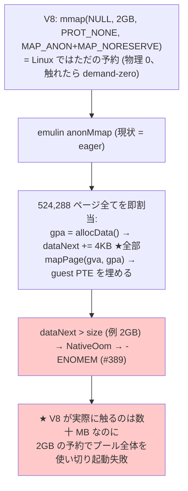
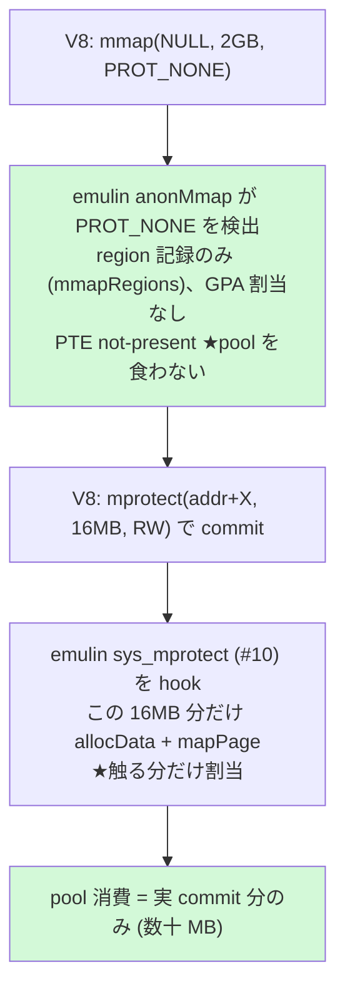
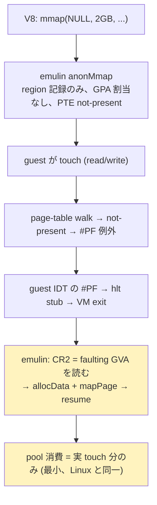
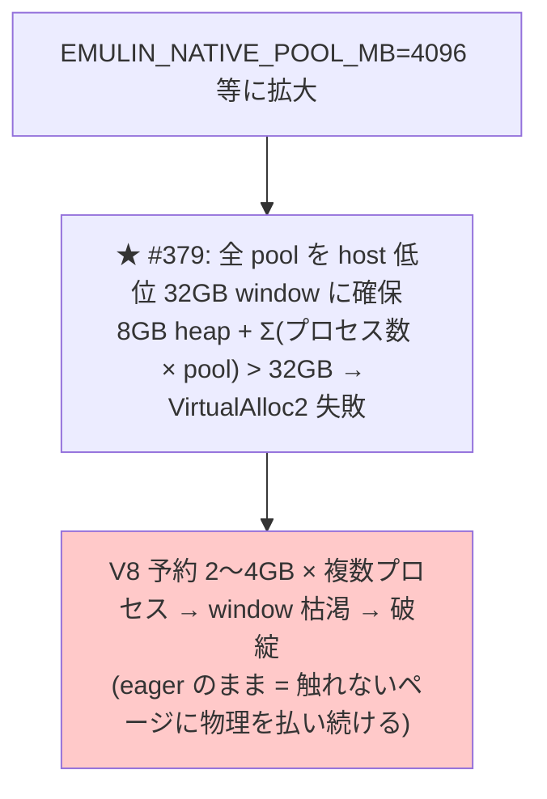
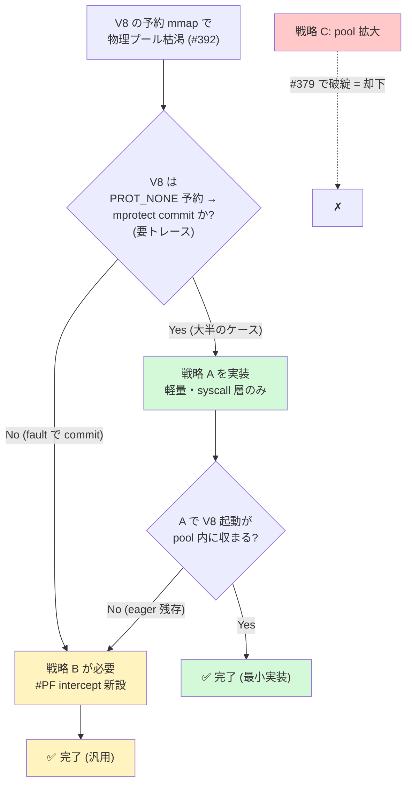

# issue #392 設計書: native backend の anonymous mmap demand paging 化

> Claude Code (V8 ベース 233MB native ELF) を動かすための mmap 戦略。
> A/B/C の戦略を図で比較し、実装方針を決定する。

---

## 1. 目的とスコープ

- **目的**: Claude Code が起動時に行う大きな mmap 予約（V8 の pointer-compression cage / heap reservation、典型 1〜4GB）で、native(WHP/KVM) backend の **guest 物理プールが枯渇**する問題を **demand paging** で解決する。
- **本書のスコープ**: 戦略 A / B / C の比較と方針決定（設計のみ。実装は後続 PR）。
- **非スコープ**: 233MB バイナリの実行速度（mmap を解決しても V8 + JIT は per-instruction overhead で遅い。§7 の caveat 参照）。

### 1.1 設計方針（優先順位）

- **backend=native（特に WHP）を最優先**。Windows native(WHP) で**実用的なソフトが動くこと**がゴール。
- **backend=software は large-mmap の設計対象外**: software は `byte[]` ベースで、大きな V8 プログラムを**どのみち実行できない**（実行速度 + Java `byte[]` の 2GB 上限）。よって large-mmap の demand paging は **native 専用機構**として設計し、software 互換に引きずられない（PROT_NONE 予約や #PF intercept は native のみで実装）。
- ただし**既存の通常プログラムの回帰は維持**する: software==native の byte-identical（大きな V8 以外）と既存 mmap テストを壊さない。demand paging は「触れたページの内容・タイミングが eager と区別できない」ように実装するので、通常プログラムには透過。
- **KVM は dev/test の proxy、WHP が本番ターゲット**。戦略 A/B とも最終的に **WHP で動くこと**を優先する（KVM で先行検証 → WHP 実機で受入）。特に戦略 B の #PF intercept は WHP の VM-exit/例外 intercept ABI で実装できることを確認する。

---

## 2. 背景

### 2.1 現状のメモリアーキテクチャ（2 段変換）

native backend は guest を実 vCPU(ring3) で走らせ、アドレスを **2 段**で変換する。
**③(host RAM) は OS の demand paging で lazy** だが、**②(guest 物理プール) の bump allocator `dataNext` は eager に前進**する。つまり「host RAM は食わないが、guest プールの GPA 空間を食い潰す」のが枯渇の元。

以下に GVA → GPA(物理プール) → host 物理 RAM の対応を、メモリ空間を箱として並べて図示する（issue #392 の核心。V8 cage は ① で GPA を全 eager 割当しプール枯渇するが、② host は touch 分だけ backing される）:

下は同じ 2 段変換の簡略フロー版:

### 2.2 問題: anonymous mmap の eager 割当

`anonMmap` は mmap 領域の **全ページに即座に GPA を割り当てる**（`allocData` を per-page で呼ぶ）。V8 が触れない予約分まで物理プールを消費して枯渇する。

加えて `alloc_huge`（> 2GB の mmap）は現状 `return -12L`（ENOMEM）で**そもそも非対応**。

---

## 3. 戦略

### 戦略 A: PROT_NONE 予約 + mprotect 時の遅延割当

V8 の cage は `PROT_NONE` で予約され、commit するサブ領域だけ `mprotect(RW)` される。この **mprotect を契機に割り当てる**。

- **#PF intercept 不要**（mprotect は syscall 層で完結）。実装は `anonMmap` の PROT_NONE 分岐 + `sys_mprotect`(#10) hook のみ。
- **前提**: V8 が「PROT_NONE 予約 → mprotect commit」パターンであること（要トレース確認、§6 Phase 0）。

### 戦略 B: 完全 demand paging（#PF intercept）

mmap 時に GPA を割り当てず、**guest が触れた時の #PF を捕捉して割り当てる**。Linux の demand-zero と完全一致。

- **あらゆる sparse mmap に効く**（V8 / Node / JSC / WASM / Go runtime / JVM 等）。
- **#PF intercept 経路の新設が必要**: guest IDT に #PF vector → hlt stub → VM exit、CR2 取得、resume。fork の CoW とも整合が要る。実装が重い。

### 戦略 C: 物理プール拡大（対症療法・非推奨）

根本解決にならず、#379 の window 制約を悪化させる。

---

## 4. 取捨選択（A/B/C の比較）

### 4.1 比較表

| 観点 | **A** PROT_NONE+mprotect | **B** #PF demand paging | **C** pool 拡大 |
|------|:---:|:---:|:---:|
| pool 物理消費 | commit 分のみ | **touch 分のみ（最小）** | 全予約分（最大） |
| 実装量 | **小**（syscall 層のみ） | 大（#PF intercept 新設） | 極小 |
| #PF intercept | 不要 | 必要 | 不要 |
| 効く範囲 | PROT_NONE 予約パターン | **全 sparse mmap** | なし（対症） |
| `alloc_huge` 統合 | 別途 | 統合可 | - |
| fork CoW 整合 | 中（mprotect 済領域を複製） | 要設計 | 影響小 |
| #379 32GB window | 緩和 | **最大緩和** | **悪化** |
| 主リスク | mprotect を介さない commit に無力 | 実装複雑・バグ余地大 | 根本解決せず破綻 |

### 4.2 意思決定フロー

---

## 5. 推奨

**段階的に A → (不足なら) B**。C は却下。

1. **戦略 A をまず実装**: 軽量（`anonMmap` の PROT_NONE 分岐 + `sys_mprotect` hook のみ）で、V8 の cage パターン（PROT_NONE 予約 → mprotect commit）に効く可能性が高い。
2. A で V8 起動が pool 内に収まらなければ（mprotect を介さない fault commit が残るなら）、**戦略 B（完全 demand paging）**へ。B は `alloc_huge` の ENOMEM 固定も demand-backed に統合できる。
3. **戦略 C は却下**（#379 の 32GB window を悪化させ、eager のままなので根本解決にならない）。

---

## 6. 段階的実装プラン

| Phase | 内容 | 戦略 |
|------|------|------|
| **0** | **トレース確認**: `EMULIN_TRACE_MMAP` + mprotect トレースで、V8 の実 mmap/mprotect パターン（PROT_NONE 予約 → mprotect commit か、fault commit か、予約サイズ）を実測。A の前提を検証 | 調査 |
| **1** | `anonMmap` に PROT_NONE 分岐: prot==0 (PROT_NONE) の anonymous mmap は **region 記録のみ**で GPA 割当せず（PTE not-present） | A |
| **2** | `sys_mprotect`(#10) hook: PROT_NONE → R/W/X への変更時、対象範囲の未割当ページを `allocData` + `mapPage` で commit。逆方向（R/W → PROT_NONE）は free-list へ返す（#334 reclaim と統合） | A |
| **3** | A の効果測定: V8 / Claude Code 起動が pool 内に収まるか。回帰（software==native byte-identical、既存 mmap テスト） | A |
| **4** | 不足時: **#PF intercept 経路**を新設（guest IDT #PF vector → hlt stub → VM exit → CR2 取得 → allocData + mapPage → resume）。fork CoW、`alloc_huge` 統合 | B |

---

## 7. 検討課題 / リスク

- **fork の copy-on-write**: demand ページ（A の mprotect-committed / B の fault-mapped）を fork 時に複製する経路。#320 (WHP lazy commit) / #335 (free-list reclaim) との整合。
- **#PF intercept の実装難度（B）**: guest IDT の #PF ハンドラ stub、CR2 読み出し、エラーコードによる read/write/exec 判別、resume。WHP/KVM 双方で動かす必要。
- **PROT_NONE の guest PTE 表現**: not-present にすると guest の合法アクセスも #PF になる。A では mprotect で先に commit するので問題ないが、B では #PF を「合法 demand fault」と「wild access」で区別する必要（mmapRegions に含まれるか）。
- **★実行速度の caveat（スコープ外だが重要）**: 本 issue は「起動時の mmap で死なない」ための**必要条件**であり、Claude Code を実用速度で動かす**十分条件ではない**。233MB の V8 + JIT は emulin の per-instruction overhead で実行が遅い。ただし demand paging は Claude Code 固有でなく、**大きな sparse mmap を使う全アプリに効く native backend の汎用改善**として価値がある。

---

## 関連

- #389: 実行中 mmap の pool 枯渇 → graceful -ENOMEM（本 issue の前段）
- #379: native pool を host 低位 32GB window に確保する制約（戦略 C が破綻する理由）
- #334 / #335: 物理プールの free-list reclaim（Phase 2 で統合）
- #320 / #304: WHP lazy commit（host 側の demand paging、本 issue は guest 側）
