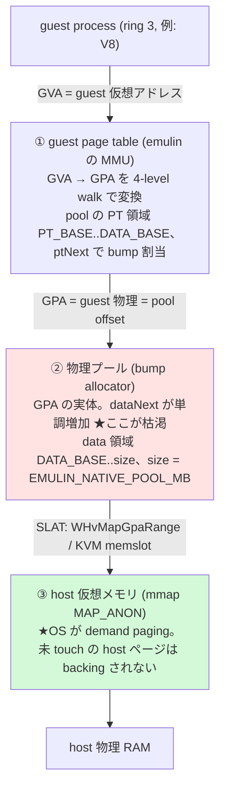
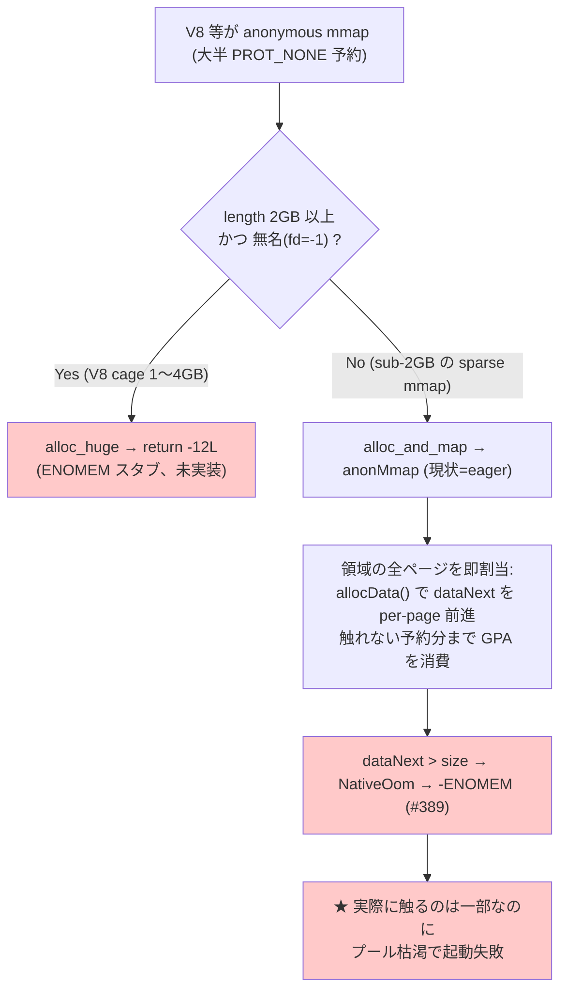
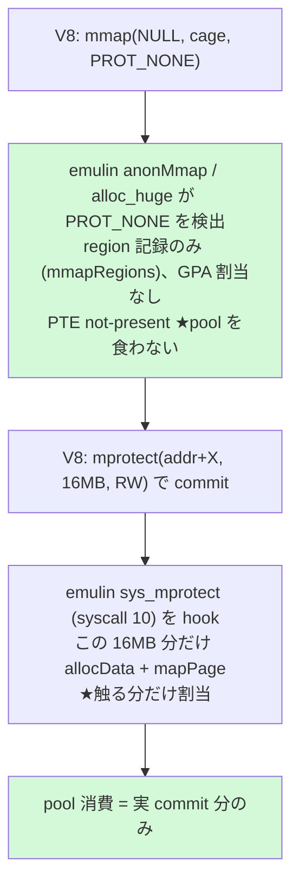
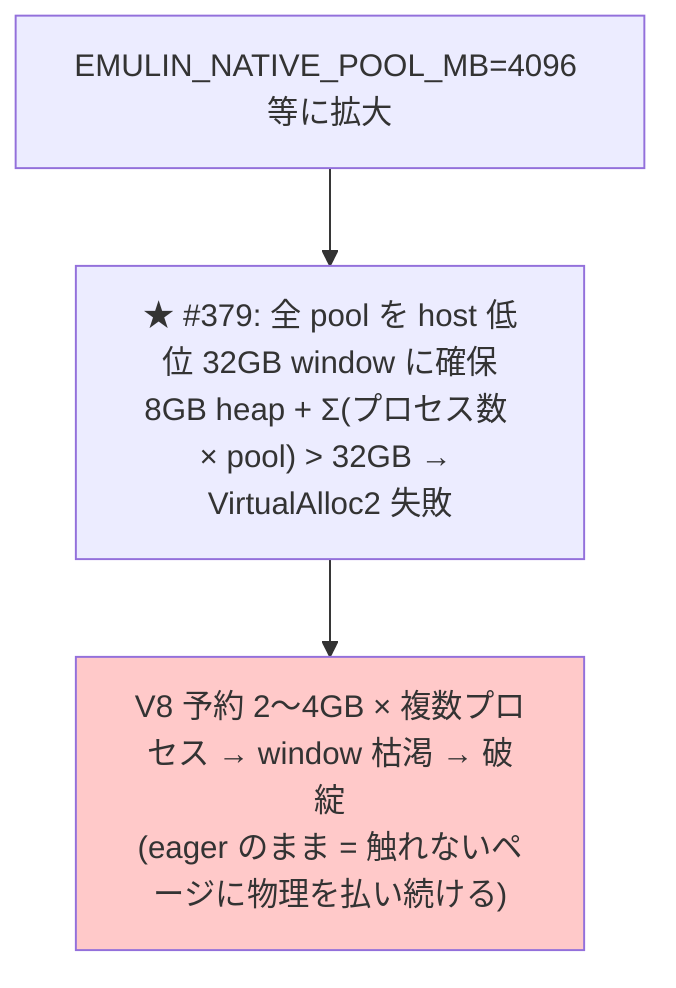
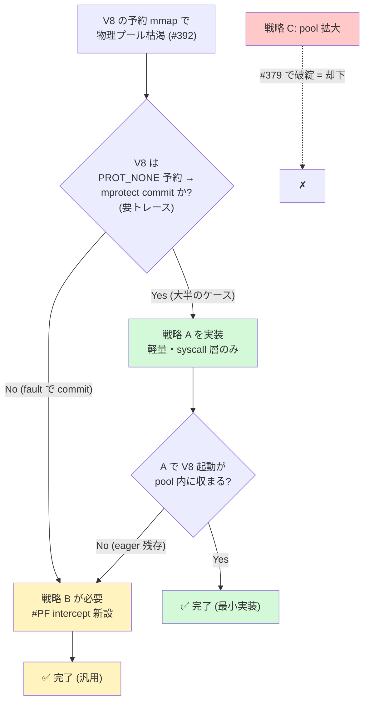

# issue #392 設計書: native backend の anonymous mmap demand paging 化

> 大きな sparse mmap（V8 の cage 予約等）で native(WHP/KVM) backend の guest 物理プールが
> 枯渇する問題を demand paging で解決する。Claude Code を起動できるようにするのが直接の動機。

---

## 0. TL;DR（結論先出し）

- **推奨**: **戦略 A**（PROT_NONE 予約 + mprotect 契機の遅延割当）を先行実装。不足なら **戦略 B**（#PF demand paging）。**戦略 C**（pool 拡大）は却下。
- **却下理由（C）**: pool 拡大は #379 の「全 pool を host 低位 32GB window に確保」制約を悪化させ、eager のままで根本解決にならない。
- **承認範囲**: 本承認で **Phase 0（トレース確認）→ Phase 1-3（戦略 A 実装 PR）**へ進む。戦略 B はトレース結果と Phase 3 効果測定を見て**別途 go 判断**。
- **⚠️ 重要 caveat**: 本件は「起動時の mmap 枯渇で**死なない**」ための**必要条件**であって、Claude Code を**実用速度で動かす十分条件ではない**（233MB の V8+JIT は遅い、§9）。価値は Claude Code 固有でなく、**大きな sparse mmap を使う全 native アプリへの汎用改善**。

---

## 1. 目的とスコープ

- **目的**: V8 の pointer-compression cage 予約等の大きな mmap で native(WHP/KVM) backend の **guest 物理プールが枯渇**する問題を **demand paging** で解決する。
- **スコープ**: 戦略 A/B/C の比較と方針決定（設計のみ。実装は後続 PR）。
- **非スコープ**: 実行速度は別問題（→ §9 参照）。

---

## 2. 用語と前提知識

後続で多用する語を先に定義する。

- **cage（V8 pointer-compression cage）**: V8 は 32bit ポインタ圧縮のため、連続した数 GB の仮想領域を 1 つ予約し、ポインタを cage 先頭からの 32bit offset で表す。予約は **PROT_NONE で取り、使う分だけ後から `mprotect` で RW 化**する。
- **SLAT（Second Level Address Translation）**: ハードウェアの 2 段目アドレス変換（GPA→HPA）。WHP は `WHvMapGpaRange`、KVM は memslot で GPA→host VA を登録する。
- **commit（本書での意味）**: ② guest 物理プールに GPA を割り当て、guest PTE を present にすること。③ host 側の物理確保（Windows `MEM_COMMIT`、#320）とは**別レイヤ**。
- **表記規約**: syscall は `mprotect(2)` / `syscall 10`、GitHub issue は `#389` で区別する。
- **hlt stub → VM exit 機構**: 現状 syscall は guest の LSTAR を hlt 命令の stub に向け、hlt が VM exit を起こして emulin がトラップしている。**戦略 B はこれを #PF vector に流用**する。
- **PROT_NONE 予約（reserve-only）**: アクセス権なしで仮想範囲だけ確保。物理は割り当てず、guest PTE は not-present のまま。

---

## 3. 設計方針（優先順位）

- **backend=native（特に WHP）を最優先**。Windows native(WHP) で実用ソフトが動くことがゴール。
- **backend=software は large-mmap 対象外**: software は `byte[]` ベースで大きな V8 をどのみち実行できない（実行速度 + Java `byte[]` の 2GB 上限）。demand paging は **native 専用機構**として設計する（PROT_NONE 予約や #PF intercept は native のみ。戦略は §5）。
- ただし**既存の通常プログラムの回帰は維持**: software==native の byte-identical と既存 mmap テストを壊さない（demand paging は eager と区別できないよう透過に実装）。
- **KVM は dev/test proxy、WHP が本番ターゲット**。戦略 A/B とも最終的に WHP で動くことを優先（KVM 先行検証 → WHP 受入）。

---

## 4. 背景: メモリアーキテクチャと eager 割当の問題

### 4.1 現状の 2 段変換アーキテクチャ

変換は **GVA→GPA（① guest page table が実施）** と **GPA→HVA（SLAT, ②→③ の辺）** の **2 段**。①②③ はアドレス空間/構成要素の名前であって変換段数ではない。**③(host RAM) は OS の demand paging で lazy** だが、**②(guest 物理プール) の bump allocator `dataNext` は eager に前進**するのが枯渇の元。

以下に GVA → GPA(物理プール) → host 物理 RAM の対応を、メモリ空間を箱として並べて図示する（V8 cage は概念的に「大きく予約 → ① で eager 割当 → プール枯渇」する一方、② host は touch 分だけ backing）。厳密な経路分岐は §4.2 を参照:

同じ 2 段変換の簡略フロー版:

### 4.2 問題: eager 割当と mmap の経路分岐

**まず `amd64_mmap` の振り分けを押さえる**（ここが図と実コードのズレを生みやすい）:

- `length ≥ 2GB かつ fd < 0` → **`alloc_huge`**（現状 `return -12L` の **ENOMEM スタブ**、未実装）
- それ未満 → **`alloc_and_map` → `anonMmap`**（**全ページを eager に GPA 割当**）

`anonMmap` は領域の全ページに即 GPA を割り当てる（`allocData` を per-page）。**sub-2GB の sparse な mmap** がこの経路で eager 割当され、触れない予約分までプールを食い潰して枯渇する（claude の crash は実際この `anonMmap` 経路）。一方 **V8 cage（典型 1〜4GB）は ≥2GB なので `alloc_huge` 経路**に入り、現状は即 ENOMEM で起動できない。

→ **両経路に demand paging が要る**: `anonMmap`（eager 全割当をやめる）と `alloc_huge`（ENOMEM スタブを demand-backed にする）。

---

## 5. 戦略（A/B/C）

**枠組み**: **A/B は割当を遅延させる方向**（A=mprotect 契機、B=#PF 契機の demand 化の度合い違い）、**C は割当方式を変えずプール容量を増やす対症策**。

### 戦略 A: PROT_NONE 予約 + mprotect 時の遅延割当
*（一行要約: mprotect 契機に割当。syscall 層のみで軽量・推奨の第一手）*

- V8 cage は PROT_NONE で予約 → サブ領域を `mprotect(RW)` で commit。emulin は **`anonMmap` と `alloc_huge` の両方**で PROT_NONE 予約を region 記録のみにし（GPA 割当なし、PTE not-present）、`mprotect(2)` 契機に commit 範囲だけ `allocData` + `mapPage` する。
- **#PF intercept 不要**（`mprotect` は syscall 層で完結）。実装は §8 Phase 1-2。
- **前提**: V8 が「PROT_NONE 予約 → mprotect commit」パターンであること（要トレース、§8 Phase 0）。

### 戦略 B: 完全 demand paging（#PF intercept）
*（一行要約: guest が触れた時の #PF で割当。汎用だが重い）*

- **あらゆる sparse mmap に効く**（V8 / Node / JSC / WASM / Go runtime / JVM 等。Linux demand-zero と一致）。
- **実装規模の実態**: 現状 native には **guest IDT/GDT/TSS が無く、CR2 reader も無い**。#PF 経路は**割込み基盤をゼロから作る大仕事**（§8 Phase 4 で 4a〜4f に分解）。`alloc_huge` の ENOMEM スタブも demand-backed に統合できる。

### 戦略 C: 物理プール拡大（却下）

`EMULIN_NATIVE_POOL_MB` 拡大は #379 の 32GB window 制約を悪化させ、eager のまま根本解決にならない。→ **却下**。

---

## 6. 取捨選択（A/B/C の比較）

### 6.1 比較表

| 観点 | **A** PROT_NONE+mprotect | **B** #PF demand paging | **C** pool 拡大 |
|------|:---:|:---:|:---:|
| pool 物理消費 | commit 分のみ | **touch 分のみ（最小）** | 全予約分（最大） |
| 実装量 | **小**（syscall 層） | 大（#PF 基盤を新設） | 極小 |
| #PF intercept | 不要 | 必要 | 不要 |
| 効く範囲 | PROT_NONE 予約パターン | **全 sparse mmap** | なし（対症） |
| anonMmap / alloc_huge への適用 | **両方必須** | demand 化に統合可 | - |
| fork 整合 | 小（eager copy で既存カバー） | 小（同上） | 影響小 |
| #379 32GB window | 緩和 | **最大緩和** | **悪化** |
| 主リスク | mprotect を介さない commit に無力 | 実装複雑・バグ余地大 | 根本解決せず破綻 |
| **総合判定 / 推奨** | **まず実施（低コスト低リスク）** | **A 不足時にエスカレーション** | **却下** |

> 脚注 #379: native pool は host 低位 32GB window に確保するため、pool を拡大すると window が枯渇する（戦略 C が破綻する理由）。

### 6.2 意思決定フロー（判断の正典）

A→B→C の判断ロジックは**この図を単一の正典**とする（§7 推奨はこの結論の宣言）。

---

## 7. 推奨と承認範囲

- **決定**: 戦略 A 先行 → 不足なら戦略 B、戦略 C 却下（判断ロジックは §6.2 図）。
- **根拠**: A は軽量（syscall 層）でリスクを段階化でき、不要なら B の重実装を回避できる。トレースで PROT_NONE→mprotect パターンが確認できれば A で足りる見込み。
- **意思決定の依頼**: 承認 = **Phase 0 トレース →（PROT_NONE→mprotect 確認なら）Phase 1-3（戦略 A 実装 PR）**へ進む。**戦略 B はトレース結果と Phase 3 効果測定を見て別途 go 判断**。

---

## 8. 段階的実装プラン

| Phase | 内容 | 戦略 |
|------|------|------|
| **0** | **トレース確認**。前提: `sys_mprotect` は現状 no-op (`return 0`) でトレース出力が無いため、先に `mprotect(2)` に `EMULIN_TRACE` 出力を追加する。その上で V8/Claude Code の mmap/mprotect パターン（PROT_NONE 予約→mprotect commit か、fault commit か）と予約サイズ（≥2GB=alloc_huge 経路か）を実測し、戦略 A の前提を検証 | 調査 |
| **1** | `anonMmap` と `alloc_huge` の**両方**で PROT_NONE 予約を **region 記録のみ**（PTE not-present）に。`anonMmap` に **prot 引数を追加**（現 signature は prot を捨てている）。占有判定（hint / brk / realloc の 3 経路）を「PTE present」だけでなく **mmapRegions の予約範囲も参照**するよう共通ヘルパ化（reserve-only と committed を同一占有扱い） | A |
| **2** | `MemoryBackend` に **`commitProtect(addr,len,prot)` を新設**。software は **no-op**（byte-identical 維持）、`sys_mprotect` / amd64 override から呼ぶ。逆方向（RW→PROT_NONE）は既定で**内容保持の not-present**、free-list 返却（#334）は内容破棄が許される **decommit 経路**（V8 decommit 等）に限定 | A |
| **3** | **A の効果測定 gate**: V8 / Claude Code 起動が pool 内に収まるか。回帰（software==native byte-identical、既存 mmap テスト）。ここで A 不足なら B へ | A |
| **4** | **戦略 B** を sub-step に分解: **4a** guest IDT/GDT/TSS 構築 + IDTR/GDTR、**4b** #PF vector の hlt stub（error code 読み）、**4c** `HvVcpu`/`KvmVcpu`/`WhpVcpu` に CR2 + error code 読み出し API、**4d** EXIT 経路で #PF を SHUTDOWN/triple fault と区別、**4e** mmapRegions 照合で legal demand fault と wild access（→SIGSEGV）を判別、**4f** WHP 例外 intercept ABI の検証 | B |

---

## 9. 検討課題 / リスク

- **fork の整合（工数小）**: 現行 `duplicate()` は CoW でなく **eager full copy**（`[0, ptNext)` の page table + `[DATA_BASE, dataNext)` の割当済 data を copy）。reserve-only は mmapRegions、commit 済ページは通常 data ページとして**既存 duplicate() でほぼカバー**。追加作業は「reserve-only データ範囲が物理ページを持たないことの確認」程度（#320 の reserve-only-gap 回避が前例）。
- **#PF の正当性判別（B、最重要の正当性論点）**: PROT_NONE を not-present にすると guest の**合法アクセスも #PF** になる。**mmapRegions 照合で「legal demand fault」と「wild access（→SIGSEGV）」を区別**するのが肝。
- **実行速度（caveat の詳細根拠）**: 233MB の V8 + JIT は emulin の per-instruction overhead で実行が遅い。本 issue は「起動時に死なない」必要条件であって十分条件ではない（TL;DR 参照）。ただし demand paging は**大きな sparse mmap を使う全 native アプリに効く汎用改善**として価値がある。

---

## 関連

- **#389**: 実行中 mmap の pool 枯渇 → graceful `-ENOMEM`（本 issue の前段）
- **#379**: native pool を host 低位 32GB window に確保する制約（戦略 C が破綻する理由、§6.1 脚注に再掲）
- **#334 / #335**: 物理プールの free-list reclaim（Phase 2 の decommit で統合）
- **#320 / #304**: WHP lazy commit（③ host 側の demand paging。本 issue は ② guest 側で別レイヤ）
