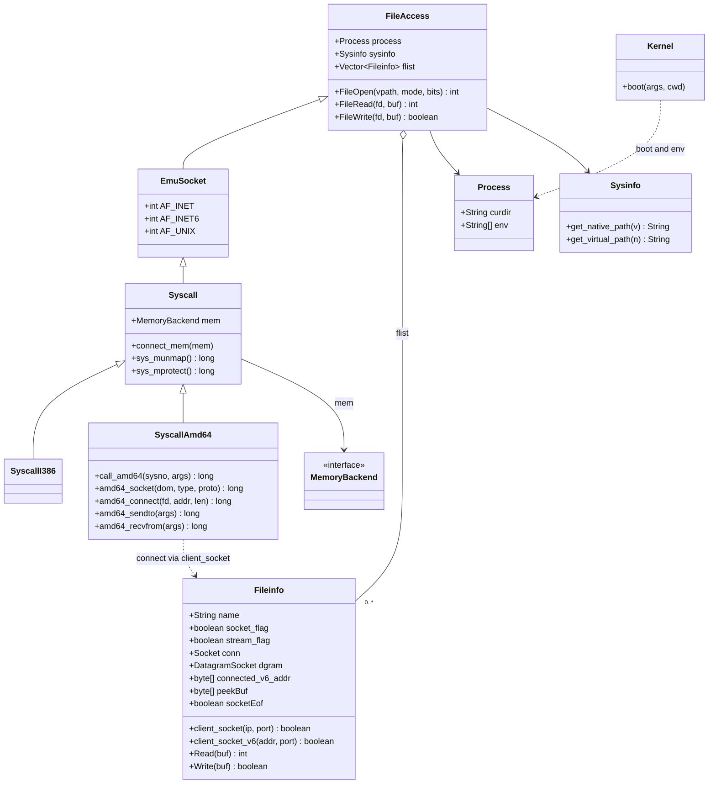
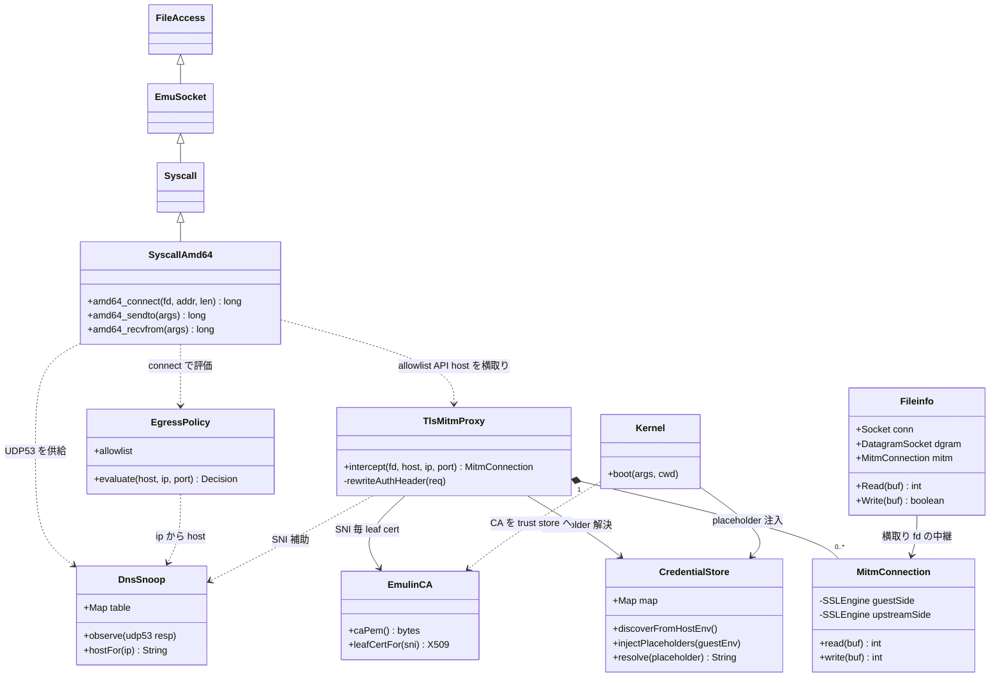

# issue #401 — 通信のサンドボックス化 (TLS-MITM credential 注入 + egress policy)

emulin の **egress 関連クラスの現状**と、#401（API キーを sandbox 外に置く TLS-MITM + default-deny egress）**実装後**のクラス図。
ここに載せるのは emulin 全体ではなく **socket/egress に関わるスライス**のみ（#401 が触る範囲）。

実測の前提（#403/#407 で観測した claude(Bun) の実 egress）:
`DNS(c-ares→8.8.8.8 UDP:53) → IPv6 connect 失敗(WSL)→IPv4 fallback → 160.79.104.10:443 TCP → TLS → Authorization ヘッダにキー`。
emulin は現状 **raw TCP/UDP を中継するだけ**（guest が in-guest で TLS、`SSLEngine` 利用ゼロ）。

---

## 1. 現在のクラス図 (egress スライス)

**egress フロー（現状）**: `SyscallAmd64.amd64_connect` → `Fileinfo.client_socket(ip,port)` が生 `java.net.Socket conn` を張る → `Fileinfo.Read/Write` で **平文バイトをそのまま中継**（TLS は guest 内）。DNS も `amd64_sendto/recvfrom` が UDP:53 を中継するだけ。

---

## 2. 設計変更後のクラス図 (#401 実装後)

### 新規クラス
| クラス | 役割 | Phase |
|---|---|---|
| **EgressPolicy** | default-deny + allowlist。`amd64_connect` で host/ip/port を評価 | 2 |
| **DnsSnoop** | 中継した DNS 応答から `ip↔hostname` map を構築（既に DNS を中継しているので無設定で hostname 解決でき、policy と SNI 推定に使う） | 1/2 共通 |
| **CredentialStore** | host 側（sandbox 外）の実キー管理。launcher env / secrets file から auto-discover、placeholder↔実キー map | 1/3 |
| **EmulinCA** | emulin 専用 CA。SNI 毎の leaf cert を動的署名。CA 証明書は秘密でないので sandbox trust store に配置可 | 1 |
| **TlsMitmProxy** | allowlist API host の connect を横取りし TLS 終端。`Authorization` の placeholder→実キー swap | 1 |
| **MitmConnection** | 接続毎に guest 側/upstream 側の 2 つの `SSLEngine` を保持し双方向に pump | 1 |

### 既存クラスの変更点
- **SyscallAmd64.amd64_connect**: ① `EgressPolicy.evaluate` で許可判定（deny は ECONNREFUSED）② allowlist の TLS 対象なら `Fileinfo.client_socket`（生中継）でなく `TlsMitmProxy.intercept` へ。
- **SyscallAmd64.amd64_sendto/recvfrom**: UDP:53 を `DnsSnoop.observe` に供給（ip↔host map 構築）。
- **Fileinfo**: 横取りした fd 用に `MitmConnection mitm` を持ち、`Read/Write` が生 `conn` でなく MITM 経由になる。
- **Kernel.boot**: `CredentialStore.injectPlaceholders` で guest env に placeholder を入れる（実キーは入れない）。起動時に `EmulinCA` の CA 証明書を sandbox の ca-bundle に配置。

### 段階
- **Phase 1**: `EgressPolicy`(最小) + `EmulinCA` + `TlsMitmProxy` + `MitmConnection` + `CredentialStore`（既知 API host の placeholder swap = 本丸）。最初に **claude が emulin CA を信頼するか（cert pinning しないか）を実証**。
- **Phase 2**: `EgressPolicy` を default-deny + allowlist に拡張（通信サンドボックス化）。
- **Phase 3**: `CredentialStore` の auto-discovery でゼロ設定 UX。

### 主要リスク
- **cert pinning**: claude/Bun が api.anthropic.com を pin していると MITM が弾かれる（Bun は BoringSSL + system/同梱 CA で pin しない前提なら可。Phase 1 冒頭で実証）。
- **HTTP/2 (HPACK)**: `Authorization` 書換えは h1 なら容易、h2 は HPACK デコード要。
- **TLS 性能**: emulin の遅い CPU での双方向 TLS 終端（既知課題 A）。
