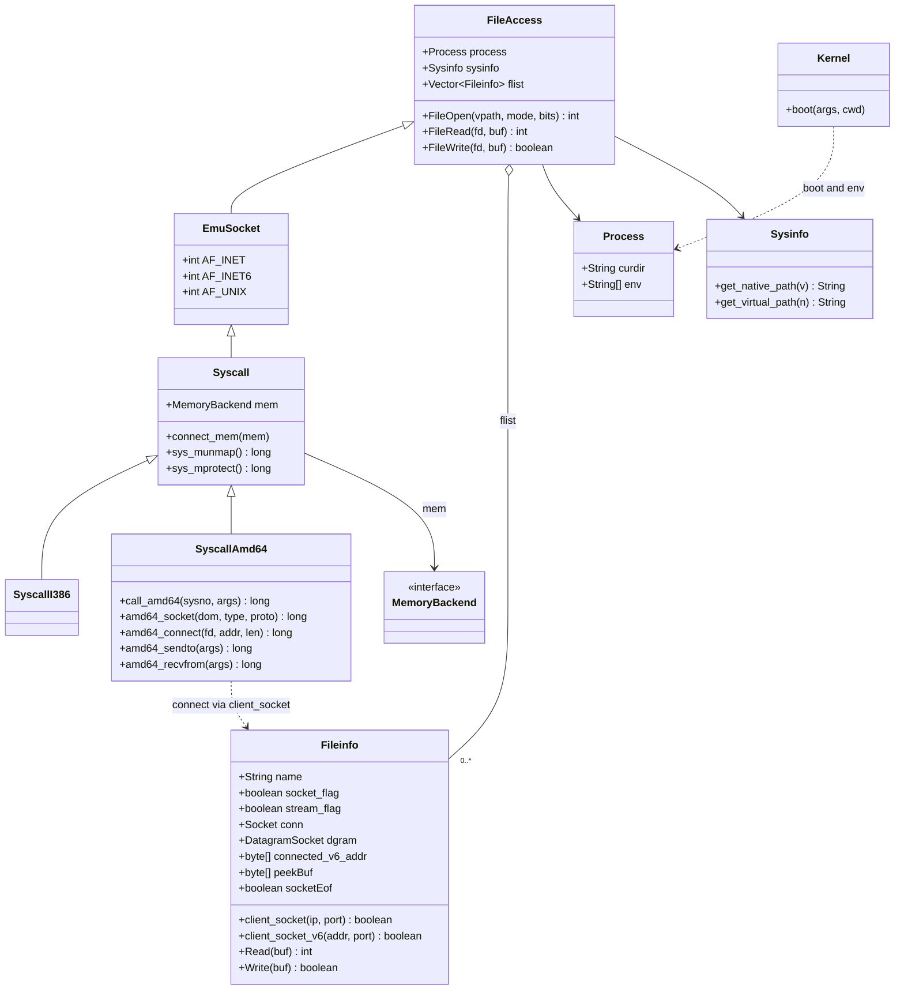
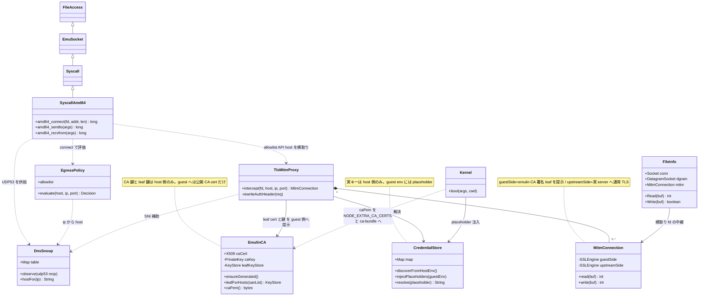
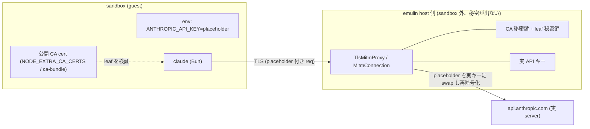

# issue #401 — 通信のサンドボックス化 (TLS-MITM credential 注入 + egress policy)

emulin の **egress 関連クラスの現状**と、#401（API キーを sandbox 外に置く TLS-MITM + default-deny egress）**実装後**のクラス図。
ここに載せるのは emulin 全体ではなく **socket/egress に関わるスライス**のみ（#401 が触る範囲）。

実測の前提（#403/#407 で観測した claude(Bun) の実 egress）:
`DNS(c-ares→8.8.8.8 UDP:53) → IPv6 connect 失敗(WSL)→IPv4 fallback → 160.79.104.10:443 TCP → TLS → Authorization ヘッダにキー`。
emulin は現状 **raw TCP/UDP を中継するだけ**（guest が in-guest で TLS、`SSLEngine` 利用ゼロ）。

---

## 1. 現在のクラス図 (egress スライス)

**egress フロー（現状）**: `SyscallAmd64.amd64_connect` → `Fileinfo.client_socket(ip,port)` が生 `java.net.Socket conn` を張る → `Fileinfo.Read/Write` で **平文バイトをそのまま中継**（TLS は guest 内）。DNS も `amd64_sendto/recvfrom` が UDP:53 を中継するだけ。

---

## 2. 設計変更後のクラス図 (#401 実装後)

### 信頼境界 (host 側 / sandbox 側)

### 新規クラス
| クラス | 役割 | Phase |
|---|---|---|
| **EgressPolicy** | default-deny + allowlist。`amd64_connect` で host/ip/port を評価 | 2 |
| **DnsSnoop** | 中継した DNS 応答から `ip↔hostname` map を構築（既に DNS を中継しているので無設定で hostname 解決でき、policy と SNI 推定に使う） | 1/2 共通 |
| **CredentialStore** | host 側（sandbox 外）の実キー管理。launcher env / secrets file から auto-discover、placeholder↔実キー map | 1/3 |
| **EmulinCA** | emulin 専用 CA（cert + 秘密鍵）。Phase1 は allowlist host を SAN にした leaf cert を初回 1 回生成、将来 SNI 毎に動的署名。CA 秘密鍵・leaf 秘密鍵は host 側のみ、公開 CA cert だけ guest の trust store へ。`sun.security.x509` で in-code 生成（依存追加ゼロ） | 1 |
| **TlsMitmProxy** | allowlist API host の connect を横取りし TLS 終端。`Authorization` の placeholder→実キー swap | 1 |
| **MitmConnection** | 接続毎に guest 側/upstream 側の 2 つの `SSLEngine` を保持し双方向に pump | 1 |

### 既存クラスの変更点
- **SyscallAmd64.amd64_connect**: ① `EgressPolicy.evaluate` で許可判定（deny は ECONNREFUSED）② allowlist の TLS 対象なら `Fileinfo.client_socket`（生中継）でなく `TlsMitmProxy.intercept` へ。
- **SyscallAmd64.amd64_sendto/recvfrom**: UDP:53 を `DnsSnoop.observe` に供給（ip↔host map 構築）。
- **Fileinfo**: 横取りした fd 用に `MitmConnection mitm` を持ち、`Read/Write` が生 `conn` でなく MITM 経由になる。
- **Kernel.boot**: `CredentialStore.injectPlaceholders` で guest env に placeholder を入れる（実キーは入れない）。起動時に `EmulinCA.ensureGenerated` → 公開 CA cert を guest env `NODE_EXTRA_CA_CERTS` に指す path + system ca-bundle に配置（CA/leaf 秘密鍵は host 側のまま）。

### 段階
- **Phase 1**: `EgressPolicy`(最小) + `EmulinCA` + `TlsMitmProxy` + `MitmConnection` + `CredentialStore`（既知 API host の placeholder swap = 本丸）。最初に **claude が emulin CA を信頼するか（cert pinning しないか）を実証**。
- **Phase 2**: `EgressPolicy` を default-deny + allowlist に拡張（通信サンドボックス化）。
- **Phase 3**: `CredentialStore` の auto-discovery でゼロ設定 UX。

### 主要リスク
- **cert pinning**: claude/Bun が api.anthropic.com を pin していると MITM が弾かれる（Bun は BoringSSL + system/同梱 CA で pin しない前提なら可。Phase 1 冒頭で実証）。
- **HTTP/2 (HPACK)**: `Authorization` 書換えは h1 なら容易、h2 は HPACK デコード要。
- **TLS 性能**: emulin の遅い CPU での双方向 TLS 終端（既知課題 A）。

---

## 3. 証明書戦略 (MITM cert)

### 信頼チェーンと秘密の所在
- **emulin CA**（cert + 秘密鍵）を host 側（`~/.emulin/`、sandbox 外）に生成。**CA 秘密鍵・leaf 秘密鍵は guest に絶対出さない**。
- guest が見るのは **公開 CA cert だけ**（trust store に配置、公開情報ゆえ安全）+ handshake 中の leaf cert（公開）。
- compromise した guest は CA 鍵を持たず**証明書を偽造不可**。CA cert は **sandbox の trust store のみ**に入れる（host の system trust には入れない＝影響範囲は当該 sandbox 限定）。

### leaf cert（2 段階）
| Phase | 方式 |
|---|---|
| **Phase 1** | allowlist host を `subjectAltName` に列挙した**静的 leaf cert を初回 1 回生成**（per-connection 署名不要、最小実装） |
| **将来** | ClientHello の **SNI 毎に動的署名**（任意 host / allowlist 拡大に対応） |

属性: leaf は `SAN(DNS:...)` 必須・EKU=`serverAuth`、CA は `basicConstraints=CA:true` + `keyUsage=keyCertSign`（現代 client は CN でなく SAN を見る）。

### guest への信頼注入（Bun/claude 向け）
- **`NODE_EXTRA_CA_CERTS=/etc/ssl/emulin-ca.pem`** を `Kernel.boot` が guest env に設定（Bun/Node が尊重する最短経路、ca-bundle 再生成不要）。
- 併せて **system ca-bundle**（`/etc/ssl/certs/ca-certificates.crt`）にも append（curl 等 non-Node client 用）。

### 生成手段（pure Java 方針）
- **採用: `sun.security.x509.*` で in-code 生成**（**依存追加ゼロ**、CA 自己署名＋leaf を CA 鍵で SAN/EKU 付き署名、動的 per-SNI も可、Windows native の bundled JRE 含め外部ツール不要）。要 `--add-exports java.base/sun.security.x509=ALL-UNNAMED`（launcher が JVM flag を握る）。
- 代替: keytool shell-out（no-code だが動的不可）/ BouncyCastle（+依存 ~5-8MB、最小依存方針に反するので不採用）。

### 実装スケッチ（`EmulinCA`）
- `ensureGenerated()`: 初回に CA（自己署名、CA:true）と allowlist SAN の leaf を生成、host 側 keystore に保存。以後再利用（trust store が毎回変わらない）。
- `leafForHosts(sanList)`: SAN 付き leaf を CA 鍵で署名し `KeyStore`（cert+鍵）を返す → `MitmConnection.guestSide` の `SSLEngine` が提示。
- `caPem()`: 公開 CA cert を PEM で返す → `NODE_EXTRA_CA_CERTS` 先 + ca-bundle へ。
