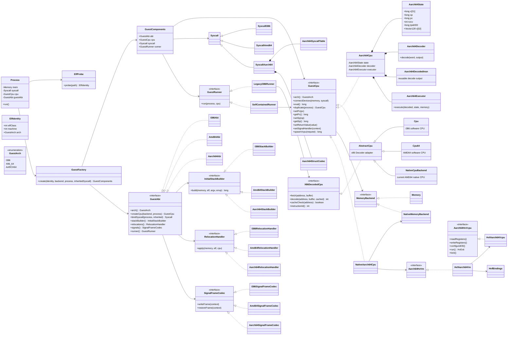
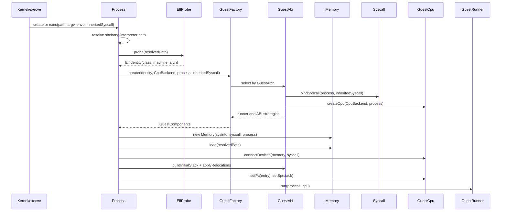

# issue #952: AArch64 guest class design

Parent: [#951](https://github.com/kiyoka/Emulin/issues/951)

Related: [#306](https://github.com/kiyoka/Emulin/issues/306), [#221](https://github.com/kiyoka/Emulin/issues/221)

## Status and scope

This document defines the class boundaries required to add Linux AArch64 as a
third guest architecture without changing existing i386/x86-64 behavior.

The first implementation milestone is deliberately small: a handwritten static
AArch64 ELF executes `write(2)` and `exit(2)` through the software backend and
matches a Linux AArch64 oracle byte-for-byte. AArch64 instruction execution,
syscall implementation, and Hypervisor.framework bindings are outside the
scope of issue #952 itself.

The long-term product target is a Debian arm64 userspace rootfs on which Emulin
can start `/bin/bash`, run coreutils and `dpkg`, and use `apt` to install and run
additional arm64 packages. The software backend remains the correctness
canonical on every host; Apple Silicon HVF is a later acceleration layer. This
does not include booting a Debian kernel or emulating a full system.

The design follows four constraints:

1. Existing x86 classes remain in package `emulin` during the refactor. Moving
   packages and adding AArch64 are separate changes.
2. `CpuAarch64` must not inherit the x86 `Decoder` instruction table.
3. `SyscallAarch64` must not inherit AMD64 syscall numbering or structure
   layout from `SyscallAmd64`.
4. The existing `HvVcpu` contract remains x86-64-specific. AArch64 vCPU control
   gets a separate contract rather than architecture conditionals in every
   method.

## Current coupling to remove

| Current location | Coupling | Required boundary |
|---|---|---|
| `AbstractCpu extends Decoder` | Every CPU inherits the x86 decoder and x86 register constants | `GuestCpu` process-facing contract; x86 keeps `AbstractCpu` as an adapter |
| `Process.run()` | Selects execution loop from `ELFCLASS64`, and contains the legacy i386 decode loop | `GuestRunner` selected by the guest ABI |
| `Process` constructor | Creates `SyscallI386` before the final ELF machine is known, then replaces it for ELF64 | `ElfIdentity` probe followed by `GuestFactory` |
| `Process.buildInitialStack64()` | AMD64 platform string, HWCAP, signal stack size, and layout live in `Process` | `InitialStackBuilder` owned by `GuestAbi` |
| `Process.resolve_irelative()` | AMD64 relocation type and trampoline bytes live in `Process` | `RelocationHandler` owned by `GuestAbi` |
| `CpuBackend` | Execution backend enum also acts as the i386/x86-64 CPU factory | `GuestArch` selects ABI; `CpuBackend` continues to select software/native |
| `SyscallAmd64` | Number dispatch, register ABI, structure encoding, and common syscall semantics are mixed | `SyscallAarch64` plus AArch64 codecs; common semantics stay in `Syscall` |
| `HvVcpu` | CPUID, MSR, XCR0, long mode, x87/XMM, and x86 logical registers | Separate `Aarch64HvVm` / `Aarch64HvVcpu` contracts |

`Memory`, `MemoryBackend`, the ELF segment loader, virtual filesystem, file
descriptors, sockets, pipes, ptys, and the common methods in `Syscall` remain
shared.

## Proposed class diagram

New interfaces and classes are marked by their names; the existing classes
remain present unless an explicit later rename is shown.

## Responsibilities

### `GuestArch`

Identifies the guest ISA and Linux ABI. It is derived from both ELF class and
`e_machine`, never from ELF class alone.

| ELF class | `e_machine` | `GuestArch` |
|---|---:|---|
| ELF32 | `EM_386` (3) | `I386` |
| ELF64 | `EM_X86_64` (62) | `X86_64` |
| ELF64 | `EM_AARCH64` (183) | `AARCH64` |

### `ElfProbe` and `ElfIdentity`

`Memory` currently needs a `Syscall` during construction, but the correct
syscall subclass is not known until the ELF header has been read. `ElfProbe`
reads only the ELF identification and machine fields after shebang resolution.
The full `Memory.load()` remains the authoritative parser and repeats all
validation; the probe is selection metadata, not a security boundary.

### `GuestFactory` and `GuestComponents`

`GuestFactory` is the only class allowed to combine a guest ABI, CPU, syscall
dispatcher, and runner. Returning these as one value prevents invalid pairs
such as `Aarch64Cpu + SyscallAmd64`.

On `execve`, `bindSyscall` preserves the inherited file descriptor table:

- same ABI: reuse the existing syscall object where current behavior requires it;
- different ABI: create the new ABI dispatcher and copy/share the existing
  `FileAccess` state with the same close-on-exec behavior;
- `fork`: `Syscall.duplicate(child)` and `GuestCpu.duplicate(child)` remain the
  ownership boundary.

### `GuestCpu`

`GuestCpu` contains only operations used by process, fork/clone, signal, and
debug orchestration. It does not expose instruction encoding details.

The first refactor keeps `AbstractCpu extends Decoder`, but changes it to also
implement `GuestCpu` and `X86DecodedCpu`. This preserves all x86 call sites and
avoids moving the hot decoder. `Aarch64Cpu` implements `GuestCpu` directly.

Existing names `set_ip`, `get_ip`, and `set_ax` can be bridged by deprecated
default adapters during migration. The architecture-neutral names are `setPc`,
`getPc`, and `setReturnValue`.

### `GuestRunner`

The runner removes ELF-class branching and the legacy decode loop from
`Process.run()`:

- `LegacyI386Runner` owns the existing fetch/cache/decode/single-step loop and
  requires `X86DecodedCpu`;
- `SelfContainedRunner` invokes `GuestCpu.eval()` for `Cpu64`,
  `NativeCpuBackend`, `Aarch64Cpu`, and later `NativeAarch64Cpu`.

Signal termination, cleanup, and orphan reaping remain process responsibilities.
Architecture-specific fault-to-signal frame delivery is delegated through the
guest ABI.

### `GuestAbi`

`GuestAbi` is a stateless architecture profile. One singleton exists per guest
architecture. It owns construction and the ABI strategies that currently live
inside `Process` or CPU-specific syscall code:

- CPU and syscall creation;
- initial process stack and auxv;
- dynamic linker path and relocations;
- signal frame encoding/restore;
- process runner selection.

It does not own process-lifetime state, memory, file descriptors, or vCPUs.

### `Aarch64Cpu`

The software CPU uses composition instead of a large inheritance tree:

- `Aarch64State`: X0-X30, SP, PC, NZCV, TPIDR_EL0, and eventually V0-V31;
- `Aarch64Decoder`: fixed-width 32-bit mask/value decoding;
- `Aarch64DecodedInsn`: a per-vCPU reusable output object to avoid allocating on
  every instruction;
- `Aarch64Executor`: instruction semantics and memory access.

The initial PoC may implement only integer ALU, branch, load/store, immediate
construction, and `SVC`. FP/SIMD and atomics are added without changing the
process-facing contract.

Decoder bring-up status for issue #951: `Aarch64DecodedInsn` now carries width,
all scalar register operands, signed immediates, shifts/extensions, condition
codes, and addressing modes. `Aarch64Decoder` recognizes move-wide, add/sub,
logical immediate/register, bitfield/extract, multiply-add, direct/indirect and
conditional branches, and the common scalar/pair load-store forms. Recognition
does not imply execution support: `Aarch64Executor` rejects every decoded
operation whose semantics have not yet been implemented.

### `SyscallAarch64`

`SyscallAarch64` extends the common `Syscall`, not `SyscallAmd64`.

- `Aarch64SyscallTable` maps AArch64 syscall numbers to common semantic methods;
- `Aarch64StructCodec` encodes ABI-specific `stat`, `sigaction`, `ucontext`,
  `rlimit`, `iovec`, and other layouts;
- `Aarch64SignalFrameCodec` owns signal frame and `rt_sigreturn` layout.

Common filesystem, process, pipe, socket, pty, and timer semantics continue to
live in `Syscall`. Shared 64-bit helpers may be extracted later only when both
AMD64 and AArch64 tests demonstrate identical semantics.

### Native AArch64 boundary

The current `NativeCpuBackend`, `HvVm`, `HvVcpu`, and `HvReg` form an x86-64
native stack even where their names look generic. `HvVcpu` exposes CPUID, MSRs,
XCR0, long-mode segments, x87/XMM state, and logical x86 registers.

Issue #952 therefore does not widen `HvVcpu` with architecture switches. The
Apple Silicon path uses separate `Aarch64HvVm` / `Aarch64HvVcpu` contracts and
shares only:

- `MemoryBackend` / `NativeMemoryBackend` concepts;
- pool ownership and leak accounting utilities that are truly ISA-neutral;
- a small exit-reason value type where semantics match;
- common Hypervisor.framework symbol loading where the C API is shared.

An eventual rename from `NativeCpuBackend` to `NativeAmd64Cpu` should be its own
behavior-diff-zero change after AArch64 interfaces exist.

## Construction sequence

`Memory.load()` must verify that the fully parsed ELF machine still equals the
probe result. A mismatch is an execution error rather than a second factory
selection.

## Ownership and lifecycle

| Object | Owner | Fork | `execve` | Thread clone |
|---|---|---|---|---|
| `GuestAbi` | static registry | shared singleton | replaced if architecture changes | shared |
| `GuestCpu` | `Process` or guest worker | `duplicate(child)` | replaced | `spawnVcpu` creates worker CPU |
| `Syscall` | `Process` | duplicate/share according to current fd rules | ABI may rebind while fd state survives | usually shared process resources |
| `Memory` | `Process` | duplicate or vfork-share | replaced after successful load | shared for `CLONE_VM` |
| `Aarch64State` | one software vCPU | copied | replaced | new child register state |
| `Aarch64HvVm` | native process CPU owner | new VM for fork | replaced | shared by worker vCPUs |
| `Aarch64HvVcpu` | one native guest thread | new vCPU | replaced | one per worker |

`GuestComponents` is a construction result, not a second owner. After creation,
the existing `Process` fields remain the lifecycle authority to limit the size
of the first refactor.

## Migration plan

Every refactor step is merged only after the existing i386/x86-64 gates pass.
AArch64 production behavior starts after the structural steps.

### PR A: documentation only

- Add this design and resolve review comments.
- No Java changes.

Gate: Mermaid renders on GitHub and the design matches current ownership paths.

### PR B: identify guest architecture

- Add `GuestArch`, `ElfIdentity`, and `ElfProbe`.
- Add full-loader verification of probe versus parsed `e_machine`.
- Keep existing CPU/syscall construction unchanged.

Gate: malformed-ELF tests, run-fast, and run-network unchanged.

### PR C: process-facing CPU and runner contracts

- Add `GuestCpu`, `X86DecodedCpu`, and `GuestRunner`.
- Make `AbstractCpu` implement the two CPU contracts without moving decoder code.
- Move the current i386 loop verbatim to `LegacyI386Runner`.
- Use `SelfContainedRunner` for existing ELF64 execution.

Gate: stdout/exit byte equality, signal/fault tests, and no software performance
regression outside the established tolerance.

### PR D: ABI profile and factory

- Add `GuestAbi`, `GuestFactory`, `GuestComponents`, `I386Abi`, and `Amd64Abi`.
- Move existing selection code from `Process` without changing values.
- Preserve fd-table ownership across fork and exec.

Gate: fork/exec/vfork/clone/CLOEXEC and dynamic-link tests.

### PR E: bootstrap strategies

- Move initial stack, relocation, and signal frame entry points behind the ABI
  strategies.
- Keep existing i386/AMD64 method bodies initially; adapters may delegate back
  to `Process` during the first step.

Gate: argv/envp/auxv/TLS/IRELATIVE/signal/rt_sigreturn tests.

### PR F: AArch64 software PoC

- Add `Aarch64Abi`, `Aarch64Cpu`, decoder/state/executor, `SyscallAarch64`, and
  the minimal stack builder.
- Recognize `EM_AARCH64=183` in the full ELF loader.
- Run a handwritten static `hello-aarch64` using `write` and `exit`.

Gate: Linux AArch64 oracle equals Emulin stdout and exit status; all existing
x86 gates remain green.

### PR G: static AArch64 userspace

- Run compiler-generated static C programs.
- Bring up a static BusyBox and its basic applets.
- Implement the AArch64 ABI surface required by static userspace, including
  `mmap`, `brk`, `clone`, and `futex` paths.

Gate: selected static BusyBox commands match a Linux AArch64 oracle while all
x86 gates remain green.

### PR H: dynamic glibc userspace

- Support AArch64 PIE and the relocations required by the dynamic loader.
- Load `/lib/ld-linux-aarch64.so.1` through the guest ABI profile.
- Run minimal dynamically linked glibc programs.

Gate: dynamic `/bin/true` and `/bin/echo` equivalents match the Linux AArch64
oracle for stdout, exit status, and inspected ABI state.

### PR I: Debian-required ABI and ISA surface

- Complete the TLS, signal, `clone`, `futex`, and pthread paths needed by the
  Debian arm64 baseline.
- Add the FP/NEON and exclusive/atomic instruction coverage used by glibc and
  Debian packages, advertising only implemented HWCAP features.
- Fill syscall numbering, errno, and structure layouts from conformance
  evidence instead of assuming AMD64 layouts.

Gate: representative threaded and signal-using Debian arm64 binaries match the
Linux AArch64 oracle under the software backend.

### PR J: Debian arm64 base rootfs

- Build an arm64 rootfs for the same Debian release tracked by the x86 bundle.
- Start `/bin/bash` and run coreutils and `dpkg` inside that rootfs.
- Add public rootfs smoke tests without committing the generated rootfs.

Gate: a pinned Debian arm64 base manifest completes the bash, coreutils, and
`dpkg` smoke suite under the software backend.

### PR K: apt and distributable arm64 bundle

- Validate DNS, TLS/certificate, time, networking, pipe, and pty behavior used
  by `apt`.
- Pass `apt update`, install a pinned package, and execute the installed arm64
  binary.
- Extend the release tooling to produce a Debian arm64 bundle.

Gate: a clean bundle can install and execute the pinned package without host
architecture leakage.

### Later: Apple Silicon native backend

- Add the separate AArch64 hypervisor contracts and HVF implementations.
- Reuse the AArch64 syscall and ABI layers from the software backend.
- Compare software and HVF output byte-for-byte.

Gate: private conformance `oracle == software == HVF native` for supported axes,
followed by the same pinned Debian arm64 rootfs smoke suite on software and HVF.

## Test split across the two repositories

### Public `Emulin`

- structural regression tests for ELF selection and invalid combinations;
- existing i386/x86-64 behavior and performance gates;
- minimal AArch64 ELF fixtures after PR F;
- fork/exec/clone/signal lifecycle tests for each supported ABI.
- static BusyBox and dynamic glibc smoke tests;
- Debian arm64 rootfs manifest plus bash/coreutils/`dpkg`/`apt` smoke scripts.

### Private conformance repository

- instruction mask/encoding oracle for AArch64;
- syscall number, errno, and structure-layout axes;
- initial stack/auxv/TLS/signal-frame validation;
- software versus Linux AArch64 oracle;
- Debian-required syscall, structure-layout, threading, FP/NEON, and atomic axes;
- later software versus Apple Silicon HVF native equivalence.

The public repository must not contain private clause manifests, expected
values, or scores.

## Open design questions

1. Should `ElfProbe` read directly from the host file or reuse a small immutable
   header object created by a split ELF parser? The direct probe has the smallest
   initial diff; a split parser is cleaner but touches more loader code.
2. Should `GuestCpu` use the existing method names first, or introduce neutral
   names with adapters immediately? The low-risk default is existing names plus
   default neutral adapters, followed by call-site migration.
3. Can parts of AMD64 and AArch64 64-bit structure encoding be shared? No helper
   is extracted until conformance tests prove the byte layouts identical.
4. Which VM/pool ownership utilities are genuinely ISA-neutral? Extract only
   after the first AArch64 HVF smoke identifies duplicated behavior.
5. Should `Aarch64Executor` remain a separate object after profiling? The class
   boundary is useful for testing; hot methods can be made final and inlinable,
   or folded into `Aarch64Cpu` if measurement requires it.

The default decision for all open questions is the option with the smallest
x86 behavior diff.
